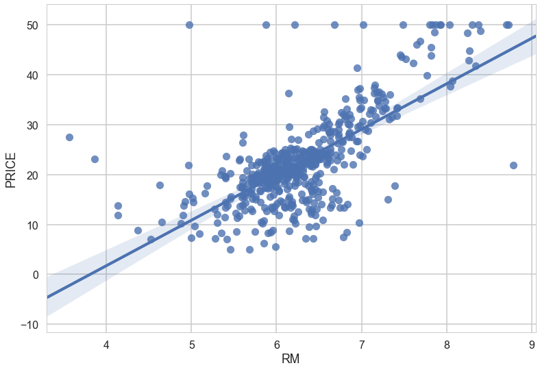
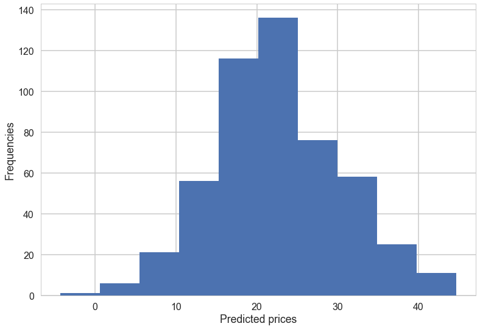

# Regression in Python

***
This is a very quick run-through of some basic statistical concepts, adapted from [Lab 4 in Harvard's CS109](https://github.com/cs109/2015lab4) course. Please feel free to try the original lab if you're feeling ambitious :-) The CS109 git repository also has the solutions if you're stuck.

* Linear Regression Models
* Prediction using linear regression
* Some re-sampling methods    
    * Train-Test splits
    * Cross Validation

Linear regression is used to model and predict continuous outcomes while logistic regression is used to model binary outcomes. We'll see some examples of linear regression as well as Train-test splits.


The packages we'll cover are: `statsmodels`, `seaborn`, and `scikit-learn`. While we don't explicitly teach `statsmodels` and `seaborn` in the Springboard workshop, those are great libraries to know.
***


***


```python
# special IPython command to prepare the notebook for matplotlib and other libraries
%pylab inline 

import numpy as np
import pandas as pd
import scipy.stats as stats
import matplotlib.pyplot as plt
import sklearn

import seaborn as sns

# special matplotlib argument for improved plots
from matplotlib import rcParams
sns.set_style("whitegrid")
sns.set_context("poster")

```

    Populating the interactive namespace from numpy and matplotlib


***
# Part 1: Linear Regression
### Purpose of linear regression
***
<div class="span5 alert alert-info">

<p> Given a dataset $X$ and $Y$, linear regression can be used to: </p>
<ul>
  <li> Build a <b>predictive model</b> to predict future values of $X_i$ without a $Y$ value.  </li>
  <li> Model the <b>strength of the relationship</b> between each dependent variable $X_i$ and $Y$</li>
    <ul>
      <li> Sometimes not all $X_i$ will have a relationship with $Y$</li>
      <li> Need to figure out which $X_i$ contributes most information to determine $Y$ </li>
    </ul>
   <li>Linear regression is used in so many applications that I won't warrant this with examples. It is in many cases, the first pass prediction algorithm for continuous outcomes. </li>
</ul>
</div>

### A brief recap (feel free to skip if you don't care about the math)
***

[Linear Regression](http://en.wikipedia.org/wiki/Linear_regression) is a method to model the relationship between a set of independent variables $X$ (also knowns as explanatory variables, features, predictors) and a dependent variable $Y$.  This method assumes the relationship between each predictor $X$ is linearly related to the dependent variable $Y$.  

$$ Y = \beta_0 + \beta_1 X + \epsilon$$

where $\epsilon$ is considered as an unobservable random variable that adds noise to the linear relationship. This is the simplest form of linear regression (one variable), we'll call this the simple model. 

* $\beta_0$ is the intercept of the linear model

* Multiple linear regression is when you have more than one independent variable
    * $X_1$, $X_2$, $X_3$, $\ldots$

$$ Y = \beta_0 + \beta_1 X_1 + \ldots + \beta_p X_p + \epsilon$$ 

* Back to the simple model. The model in linear regression is the *conditional mean* of $Y$ given the values in $X$ is expressed a linear function.  

$$ y = f(x) = E(Y | X = x)$$ 


http://www.learner.org/courses/againstallodds/about/glossary.html

* The goal is to estimate the coefficients (e.g. $\beta_0$ and $\beta_1$). We represent the estimates of the coefficients with a "hat" on top of the letter.  

$$ \hat{\beta}_0, \hat{\beta}_1 $$

* Once you estimate the coefficients $\hat{\beta}_0$ and $\hat{\beta}_1$, you can use these to predict new values of $Y$

$$\hat{y} = \hat{\beta}_0 + \hat{\beta}_1 x_1$$


* How do you estimate the coefficients? 
    * There are many ways to fit a linear regression model
    * The method called **least squares** is one of the most common methods
    * We will discuss least squares today
    
#### Estimating $\hat\beta$: Least squares
***
[Least squares](http://en.wikipedia.org/wiki/Least_squares) is a method that can estimate the coefficients of a linear model by minimizing the difference between the following: 

$$ S = \sum_{i=1}^N r_i = \sum_{i=1}^N (y_i - (\beta_0 + \beta_1 x_i))^2 $$

where $N$ is the number of observations.  

* We will not go into the mathematical details, but the least squares estimates $\hat{\beta}_0$ and $\hat{\beta}_1$ minimize the sum of the squared residuals $r_i = y_i - (\beta_0 + \beta_1 x_i)$ in the model (i.e. makes the difference between the observed $y_i$ and linear model $\beta_0 + \beta_1 x_i$ as small as possible). 

The solution can be written in compact matrix notation as

$$\hat\beta =  (X^T X)^{-1}X^T Y$$ 

We wanted to show you this in case you remember linear algebra, in order for this solution to exist we need $X^T X$ to be invertible. Of course this requires a few extra assumptions, $X$ must be full rank so that $X^T X$ is invertible, etc. **This is important for us because this means that having redundant features in our regression models will lead to poorly fitting (and unstable) models.** We'll see an implementation of this in the extra linear regression example.

**Note**: The "hat" means it is an estimate of the coefficient.  

***
# Part 2: Boston Housing Data Set

The [Boston Housing data set](https://archive.ics.uci.edu/ml/datasets/Housing) contains information about the housing values in suburbs of Boston.  This dataset was originally taken from the StatLib library which is maintained at Carnegie Mellon University and is now available on the UCI Machine Learning Repository. 


## Load the Boston Housing data set from `sklearn`
***

This data set is available in the [sklearn](http://scikit-learn.org/stable/modules/generated/sklearn.datasets.load_boston.html#sklearn.datasets.load_boston) python module which is how we will access it today.  


```python
from sklearn.datasets import load_boston
boston = load_boston()
```


```python
boston.keys()
```


    ['data', 'feature_names', 'DESCR', 'target']


```python
boston.data.shape
```


    (506, 13)


```python
# Print column names
print boston.feature_names
```

    ['CRIM' 'ZN' 'INDUS' 'CHAS' 'NOX' 'RM' 'AGE' 'DIS' 'RAD' 'TAX' 'PTRATIO'
     'B' 'LSTAT']


```python
# Print description of Boston housing data set
print boston.DESCR
```

    Boston House Prices dataset
    ===========================
    
    Notes
    ------
    Data Set Characteristics:  
    
        :Number of Instances: 506 
    
        :Number of Attributes: 13 numeric/categorical predictive
        
        :Median Value (attribute 14) is usually the target
    
        :Attribute Information (in order):
            - CRIM     per capita crime rate by town
            - ZN       proportion of residential land zoned for lots over 25,000 sq.ft.
            - INDUS    proportion of non-retail business acres per town
            - CHAS     Charles River dummy variable (= 1 if tract bounds river; 0 otherwise)
            - NOX      nitric oxides concentration (parts per 10 million)
            - RM       average number of rooms per dwelling
            - AGE      proportion of owner-occupied units built prior to 1940
            - DIS      weighted distances to five Boston employment centres
            - RAD      index of accessibility to radial highways
            - TAX      full-value property-tax rate per $10,000
            - PTRATIO  pupil-teacher ratio by town
            - B        1000(Bk - 0.63)^2 where Bk is the proportion of blacks by town
            - LSTAT    % lower status of the population
            - MEDV     Median value of owner-occupied homes in $1000's
    
        :Missing Attribute Values: None
    
        :Creator: Harrison, D. and Rubinfeld, D.L.
    
    This is a copy of UCI ML housing dataset.
    http://archive.ics.uci.edu/ml/datasets/Housing
    
    
    This dataset was taken from the StatLib library which is maintained at Carnegie Mellon University.
    
    The Boston house-price data of Harrison, D. and Rubinfeld, D.L. 'Hedonic
    prices and the demand for clean air', J. Environ. Economics & Management,
    vol.5, 81-102, 1978.   Used in Belsley, Kuh & Welsch, 'Regression diagnostics
    ...', Wiley, 1980.   N.B. Various transformations are used in the table on
    pages 244-261 of the latter.
    
    The Boston house-price data has been used in many machine learning papers that address regression
    problems.   
         
    **References**
    
       - Belsley, Kuh & Welsch, 'Regression diagnostics: Identifying Influential Data and Sources of Collinearity', Wiley, 1980. 244-261.
       - Quinlan,R. (1993). Combining Instance-Based and Model-Based Learning. In Proceedings on the Tenth International Conference of Machine Learning, 236-243, University of Massachusetts, Amherst. Morgan Kaufmann.
       - many more! (see http://archive.ics.uci.edu/ml/datasets/Housing)
    


Now let's explore the data set itself. 


```python
bos = pd.DataFrame(boston.data)
bos.head()
```


<div>
<table border="1" class="dataframe">
  <thead>
    <tr style="text-align: right;">
      <th></th>
      <th>0</th>
      <th>1</th>
      <th>2</th>
      <th>3</th>
      <th>4</th>
      <th>5</th>
      <th>6</th>
      <th>7</th>
      <th>8</th>
      <th>9</th>
      <th>10</th>
      <th>11</th>
      <th>12</th>
    </tr>
  </thead>
  <tbody>
    <tr>
      <th>0</th>
      <td>0.00632</td>
      <td>18.0</td>
      <td>2.31</td>
      <td>0.0</td>
      <td>0.538</td>
      <td>6.575</td>
      <td>65.2</td>
      <td>4.0900</td>
      <td>1.0</td>
      <td>296.0</td>
      <td>15.3</td>
      <td>396.90</td>
      <td>4.98</td>
    </tr>
    <tr>
      <th>1</th>
      <td>0.02731</td>
      <td>0.0</td>
      <td>7.07</td>
      <td>0.0</td>
      <td>0.469</td>
      <td>6.421</td>
      <td>78.9</td>
      <td>4.9671</td>
      <td>2.0</td>
      <td>242.0</td>
      <td>17.8</td>
      <td>396.90</td>
      <td>9.14</td>
    </tr>
    <tr>
      <th>2</th>
      <td>0.02729</td>
      <td>0.0</td>
      <td>7.07</td>
      <td>0.0</td>
      <td>0.469</td>
      <td>7.185</td>
      <td>61.1</td>
      <td>4.9671</td>
      <td>2.0</td>
      <td>242.0</td>
      <td>17.8</td>
      <td>392.83</td>
      <td>4.03</td>
    </tr>
    <tr>
      <th>3</th>
      <td>0.03237</td>
      <td>0.0</td>
      <td>2.18</td>
      <td>0.0</td>
      <td>0.458</td>
      <td>6.998</td>
      <td>45.8</td>
      <td>6.0622</td>
      <td>3.0</td>
      <td>222.0</td>
      <td>18.7</td>
      <td>394.63</td>
      <td>2.94</td>
    </tr>
    <tr>
      <th>4</th>
      <td>0.06905</td>
      <td>0.0</td>
      <td>2.18</td>
      <td>0.0</td>
      <td>0.458</td>
      <td>7.147</td>
      <td>54.2</td>
      <td>6.0622</td>
      <td>3.0</td>
      <td>222.0</td>
      <td>18.7</td>
      <td>396.90</td>
      <td>5.33</td>
    </tr>
  </tbody>
</table>
</div>


There are no column names in the DataFrame. Let's add those. 


```python
bos.columns = boston.feature_names
bos.head()
```


<div>
<table border="1" class="dataframe">
  <thead>
    <tr style="text-align: right;">
      <th></th>
      <th>CRIM</th>
      <th>ZN</th>
      <th>INDUS</th>
      <th>CHAS</th>
      <th>NOX</th>
      <th>RM</th>
      <th>AGE</th>
      <th>DIS</th>
      <th>RAD</th>
      <th>TAX</th>
      <th>PTRATIO</th>
      <th>B</th>
      <th>LSTAT</th>
    </tr>
  </thead>
  <tbody>
    <tr>
      <th>0</th>
      <td>0.00632</td>
      <td>18.0</td>
      <td>2.31</td>
      <td>0.0</td>
      <td>0.538</td>
      <td>6.575</td>
      <td>65.2</td>
      <td>4.0900</td>
      <td>1.0</td>
      <td>296.0</td>
      <td>15.3</td>
      <td>396.90</td>
      <td>4.98</td>
    </tr>
    <tr>
      <th>1</th>
      <td>0.02731</td>
      <td>0.0</td>
      <td>7.07</td>
      <td>0.0</td>
      <td>0.469</td>
      <td>6.421</td>
      <td>78.9</td>
      <td>4.9671</td>
      <td>2.0</td>
      <td>242.0</td>
      <td>17.8</td>
      <td>396.90</td>
      <td>9.14</td>
    </tr>
    <tr>
      <th>2</th>
      <td>0.02729</td>
      <td>0.0</td>
      <td>7.07</td>
      <td>0.0</td>
      <td>0.469</td>
      <td>7.185</td>
      <td>61.1</td>
      <td>4.9671</td>
      <td>2.0</td>
      <td>242.0</td>
      <td>17.8</td>
      <td>392.83</td>
      <td>4.03</td>
    </tr>
    <tr>
      <th>3</th>
      <td>0.03237</td>
      <td>0.0</td>
      <td>2.18</td>
      <td>0.0</td>
      <td>0.458</td>
      <td>6.998</td>
      <td>45.8</td>
      <td>6.0622</td>
      <td>3.0</td>
      <td>222.0</td>
      <td>18.7</td>
      <td>394.63</td>
      <td>2.94</td>
    </tr>
    <tr>
      <th>4</th>
      <td>0.06905</td>
      <td>0.0</td>
      <td>2.18</td>
      <td>0.0</td>
      <td>0.458</td>
      <td>7.147</td>
      <td>54.2</td>
      <td>6.0622</td>
      <td>3.0</td>
      <td>222.0</td>
      <td>18.7</td>
      <td>396.90</td>
      <td>5.33</td>
    </tr>
  </tbody>
</table>
</div>


Now we have a pandas DataFrame called `bos` containing all the data we want to use to predict Boston Housing prices.  Let's create a variable called `PRICE` which will contain the prices. This information is contained in the `target` data. 


```python
print boston.target.shape
```

    (506,)


```python
bos['PRICE'] = boston.target
bos.head()
```


<div>
<table border="1" class="dataframe">
  <thead>
    <tr style="text-align: right;">
      <th></th>
      <th>CRIM</th>
      <th>ZN</th>
      <th>INDUS</th>
      <th>CHAS</th>
      <th>NOX</th>
      <th>RM</th>
      <th>AGE</th>
      <th>DIS</th>
      <th>RAD</th>
      <th>TAX</th>
      <th>PTRATIO</th>
      <th>B</th>
      <th>LSTAT</th>
      <th>PRICE</th>
    </tr>
  </thead>
  <tbody>
    <tr>
      <th>0</th>
      <td>0.00632</td>
      <td>18.0</td>
      <td>2.31</td>
      <td>0.0</td>
      <td>0.538</td>
      <td>6.575</td>
      <td>65.2</td>
      <td>4.0900</td>
      <td>1.0</td>
      <td>296.0</td>
      <td>15.3</td>
      <td>396.90</td>
      <td>4.98</td>
      <td>24.0</td>
    </tr>
    <tr>
      <th>1</th>
      <td>0.02731</td>
      <td>0.0</td>
      <td>7.07</td>
      <td>0.0</td>
      <td>0.469</td>
      <td>6.421</td>
      <td>78.9</td>
      <td>4.9671</td>
      <td>2.0</td>
      <td>242.0</td>
      <td>17.8</td>
      <td>396.90</td>
      <td>9.14</td>
      <td>21.6</td>
    </tr>
    <tr>
      <th>2</th>
      <td>0.02729</td>
      <td>0.0</td>
      <td>7.07</td>
      <td>0.0</td>
      <td>0.469</td>
      <td>7.185</td>
      <td>61.1</td>
      <td>4.9671</td>
      <td>2.0</td>
      <td>242.0</td>
      <td>17.8</td>
      <td>392.83</td>
      <td>4.03</td>
      <td>34.7</td>
    </tr>
    <tr>
      <th>3</th>
      <td>0.03237</td>
      <td>0.0</td>
      <td>2.18</td>
      <td>0.0</td>
      <td>0.458</td>
      <td>6.998</td>
      <td>45.8</td>
      <td>6.0622</td>
      <td>3.0</td>
      <td>222.0</td>
      <td>18.7</td>
      <td>394.63</td>
      <td>2.94</td>
      <td>33.4</td>
    </tr>
    <tr>
      <th>4</th>
      <td>0.06905</td>
      <td>0.0</td>
      <td>2.18</td>
      <td>0.0</td>
      <td>0.458</td>
      <td>7.147</td>
      <td>54.2</td>
      <td>6.0622</td>
      <td>3.0</td>
      <td>222.0</td>
      <td>18.7</td>
      <td>396.90</td>
      <td>5.33</td>
      <td>36.2</td>
    </tr>
  </tbody>
</table>
</div>


## EDA and Summary Statistics
***

Let's explore this data set.  First we use `describe()` to get basic summary statistics for each of the columns. 


```python
bos.describe()
```


<div>
<table border="1" class="dataframe">
  <thead>
    <tr style="text-align: right;">
      <th></th>
      <th>CRIM</th>
      <th>ZN</th>
      <th>INDUS</th>
      <th>CHAS</th>
      <th>NOX</th>
      <th>RM</th>
      <th>AGE</th>
      <th>DIS</th>
      <th>RAD</th>
      <th>TAX</th>
      <th>PTRATIO</th>
      <th>B</th>
      <th>LSTAT</th>
      <th>PRICE</th>
    </tr>
  </thead>
  <tbody>
    <tr>
      <th>count</th>
      <td>506.000000</td>
      <td>506.000000</td>
      <td>506.000000</td>
      <td>506.000000</td>
      <td>506.000000</td>
      <td>506.000000</td>
      <td>506.000000</td>
      <td>506.000000</td>
      <td>506.000000</td>
      <td>506.000000</td>
      <td>506.000000</td>
      <td>506.000000</td>
      <td>506.000000</td>
      <td>506.000000</td>
    </tr>
    <tr>
      <th>mean</th>
      <td>3.593761</td>
      <td>11.363636</td>
      <td>11.136779</td>
      <td>0.069170</td>
      <td>0.554695</td>
      <td>6.284634</td>
      <td>68.574901</td>
      <td>3.795043</td>
      <td>9.549407</td>
      <td>408.237154</td>
      <td>18.455534</td>
      <td>356.674032</td>
      <td>12.653063</td>
      <td>22.532806</td>
    </tr>
    <tr>
      <th>std</th>
      <td>8.596783</td>
      <td>23.322453</td>
      <td>6.860353</td>
      <td>0.253994</td>
      <td>0.115878</td>
      <td>0.702617</td>
      <td>28.148861</td>
      <td>2.105710</td>
      <td>8.707259</td>
      <td>168.537116</td>
      <td>2.164946</td>
      <td>91.294864</td>
      <td>7.141062</td>
      <td>9.197104</td>
    </tr>
    <tr>
      <th>min</th>
      <td>0.006320</td>
      <td>0.000000</td>
      <td>0.460000</td>
      <td>0.000000</td>
      <td>0.385000</td>
      <td>3.561000</td>
      <td>2.900000</td>
      <td>1.129600</td>
      <td>1.000000</td>
      <td>187.000000</td>
      <td>12.600000</td>
      <td>0.320000</td>
      <td>1.730000</td>
      <td>5.000000</td>
    </tr>
    <tr>
      <th>25%</th>
      <td>0.082045</td>
      <td>0.000000</td>
      <td>5.190000</td>
      <td>0.000000</td>
      <td>0.449000</td>
      <td>5.885500</td>
      <td>45.025000</td>
      <td>2.100175</td>
      <td>4.000000</td>
      <td>279.000000</td>
      <td>17.400000</td>
      <td>375.377500</td>
      <td>6.950000</td>
      <td>17.025000</td>
    </tr>
    <tr>
      <th>50%</th>
      <td>0.256510</td>
      <td>0.000000</td>
      <td>9.690000</td>
      <td>0.000000</td>
      <td>0.538000</td>
      <td>6.208500</td>
      <td>77.500000</td>
      <td>3.207450</td>
      <td>5.000000</td>
      <td>330.000000</td>
      <td>19.050000</td>
      <td>391.440000</td>
      <td>11.360000</td>
      <td>21.200000</td>
    </tr>
    <tr>
      <th>75%</th>
      <td>3.647423</td>
      <td>12.500000</td>
      <td>18.100000</td>
      <td>0.000000</td>
      <td>0.624000</td>
      <td>6.623500</td>
      <td>94.075000</td>
      <td>5.188425</td>
      <td>24.000000</td>
      <td>666.000000</td>
      <td>20.200000</td>
      <td>396.225000</td>
      <td>16.955000</td>
      <td>25.000000</td>
    </tr>
    <tr>
      <th>max</th>
      <td>88.976200</td>
      <td>100.000000</td>
      <td>27.740000</td>
      <td>1.000000</td>
      <td>0.871000</td>
      <td>8.780000</td>
      <td>100.000000</td>
      <td>12.126500</td>
      <td>24.000000</td>
      <td>711.000000</td>
      <td>22.000000</td>
      <td>396.900000</td>
      <td>37.970000</td>
      <td>50.000000</td>
    </tr>
  </tbody>
</table>
</div>


### Scatter plots
***

Let's look at some scatter plots for three variables: 'CRIM', 'RM' and 'PTRATIO'. 

What kind of relationship do you see? e.g. positive, negative?  linear? non-linear? 


```python
plt.scatter(bos.CRIM, bos.PRICE)
plt.xlabel("Per capita crime rate by town (CRIM)")
plt.ylabel("Housing Price")
plt.title("Relationship between CRIM and Price")
```


    <matplotlib.text.Text at 0x11b233750>


**Your turn**: Create scatter plots between *RM* and *PRICE*, and *PTRATIO* and *PRICE*. What do you notice? 


```python
#your turn: scatter plot between *RM* and *PRICE*
plt.scatter(bos.RM, bos.PRICE)
plt.xlabel('Rooms per dwelling (RM)')
plt.ylabel('Housing Price')
plt.show()
```


```python
#your turn: scatter plot between *PTRATIO* and *PRICE*
plt.scatter(bos.PTRATIO, bos.PRICE)
plt.xlabel('Pupil/Teacher ratio')
plt.ylabel('Housing price')
```


    <matplotlib.text.Text at 0x11bc3e390>


**Your turn**: What are some other numeric variables of interest? Plot scatter plots with these variables and *PRICE*.


```python
#your turn: create some other scatter plots
plt.scatter(bos.ZN, bos.PRICE)
plt.xlabel('Proportion of residential land zoned for > 25,000 ft sq')
plt.ylabel('Housing Price')
plt.show()
plt.scatter(bos.DIS, bos.PRICE)
plt.xlabel('Distance to empolyment centers')
plt.ylabel('Housing Price')
```


    <matplotlib.text.Text at 0x11b776ad0>


### Scatter Plots using Seaborn
***

[Seaborn](https://stanford.edu/~mwaskom/software/seaborn/) is a cool Python plotting library built on top of matplotlib. It provides convenient syntax and shortcuts for many common types of plots, along with better-looking defaults.

We can also use [seaborn regplot](https://stanford.edu/~mwaskom/software/seaborn/tutorial/regression.html#functions-to-draw-linear-regression-models) for the scatterplot above. This provides automatic linear regression fits (useful for data exploration later on). Here's one example below.


```python
sns.regplot(y="PRICE", x="RM", data=bos, fit_reg = True)
```


    <matplotlib.axes._subplots.AxesSubplot at 0x11c3c8090>





### Histograms
***


Histograms are a useful way to visually summarize the statistical properties of numeric variables. They can give you an idea of the mean and the spread of the variables as well as outliers.


```python
plt.hist(bos.CRIM)
plt.title("CRIM")
plt.xlabel("Crime rate per capita")
plt.ylabel("Frequency")
plt.show()
```


**Your turn**: Plot separate histograms and one for *RM*, one for *PTRATIO*. Any interesting observations?


```python
#your turn
plt.hist(bos.RM)
plt.xlabel('Average number of rooms per dwelling')
plt.ylabel('Frequency')
plt.show()

plt.hist(bos.PTRATIO)
plt.xlabel('Pupil/Teacher ratio')
```


    <matplotlib.text.Text at 0x11d3bffd0>


## Linear regression with  Boston housing data example
***

Here, 

$Y$ = boston housing prices (also called "target" data in python)

and

$X$ = all the other features (or independent variables)

which we will use to fit a linear regression model and predict Boston housing prices. We will use the least squares method as the way to estimate the coefficients.  

We'll use two ways of fitting a linear regression. We recommend the first but the second is also powerful in its features.

### Fitting Linear Regression using `statsmodels`
***
[Statsmodels](http://statsmodels.sourceforge.net/) is a great Python library for a lot of basic and inferential statistics. It also provides basic regression functions using an R-like syntax, so it's commonly used by statisticians. While we don't cover statsmodels officially in the Data Science Intensive, it's a good library to have in your toolbox. Here's a quick example of what you could do with it.


```python
# Import regression modules
# ols - stands for Ordinary least squares, we'll use this
import statsmodels.api as sm
from statsmodels.formula.api import ols
```


```python
# statsmodels works nicely with pandas dataframes
# The thing inside the "quotes" is called a formula, a bit on that below
m = ols('PRICE ~ RM',bos).fit()
print m.summary()
```

                                OLS Regression Results                            
    ==============================================================================
    Dep. Variable:                  PRICE   R-squared:                       0.484
    Model:                            OLS   Adj. R-squared:                  0.483
    Method:                 Least Squares   F-statistic:                     471.8
    Date:                Fri, 26 May 2017   Prob (F-statistic):           2.49e-74
    Time:                        16:37:13   Log-Likelihood:                -1673.1
    No. Observations:                 506   AIC:                             3350.
    Df Residuals:                     504   BIC:                             3359.
    Df Model:                           1                                         
    Covariance Type:            nonrobust                                         
    ==============================================================================
                     coef    std err          t      P>|t|      [0.025      0.975]
    ------------------------------------------------------------------------------
    Intercept    -34.6706      2.650    -13.084      0.000     -39.877     -29.465
    RM             9.1021      0.419     21.722      0.000       8.279       9.925
    ==============================================================================
    Omnibus:                      102.585   Durbin-Watson:                   0.684
    Prob(Omnibus):                  0.000   Jarque-Bera (JB):              612.449
    Skew:                           0.726   Prob(JB):                    1.02e-133
    Kurtosis:                       8.190   Cond. No.                         58.4
    ==============================================================================
    
    Warnings:
    [1] Standard Errors assume that the covariance matrix of the errors is correctly specified.


#### Interpreting coefficients

There is a ton of information in this output. But we'll concentrate on the coefficient table (middle table). We can interpret the `RM` coefficient (9.1021) by first noticing that the p-value (under `P>|t|`) is so small, basically zero. We can interpret the coefficient as, if we compare two groups of towns, one where the average number of rooms is say $5$ and the other group is the same except that they all have $6$ rooms. For these two groups the average difference in house prices is about $9.1$ (in thousands) so about $\$9,100$ difference. The confidence interval fives us a range of plausible values for this difference, about ($\$8,279, \$9,925$), deffinitely not chump change. 

####  `statsmodels` formulas
***
This formula notation will seem familiar to `R` users, but will take some getting used to for people coming from other languages or are new to statistics.

The formula gives instruction for a general structure for a regression call. For `statsmodels` (`ols` or `logit`) calls you need to have a Pandas dataframe with column names that you will add to your formula. In the below example you need a pandas data frame that includes the columns named (`Outcome`, `X1`,`X2`, ...), bbut you don't need to build a new dataframe for every regression. Use the same dataframe with all these things in it. The structure is very simple:

`Outcome ~ X1`

But of course we want to to be able to handle more complex models, for example multiple regression is doone like this:

`Outcome ~ X1 + X2 + X3`

This is the very basic structure but it should be enough to get you through the homework. Things can get much more complex, for a quick run-down of further uses see the `statsmodels` [help page](http://statsmodels.sourceforge.net/devel/example_formulas.html).


Let's see how our model actually fit our data. We can see below that there is a ceiling effect, we should probably look into that. Also, for large values of $Y$ we get underpredictions, most predictions are below the 45-degree gridlines. 

**Your turn:** Create a scatterpot between the predicted prices, available in `m.fittedvalues` and the original prices. How does the plot look?


```python
# your turn
plt.scatter(m.fittedvalues, bos.PRICE)
```


    <matplotlib.collections.PathCollection at 0x11e3fc550>


### Fitting Linear Regression using `sklearn`


```python
from sklearn.linear_model import LinearRegression
X = bos.drop('PRICE', axis = 1)

# This creates a LinearRegression object
lm = LinearRegression()
lm
```


    LinearRegression(copy_X=True, fit_intercept=True, n_jobs=1, normalize=False)


#### What can you do with a LinearRegression object? 
***
Check out the scikit-learn [docs here](http://scikit-learn.org/stable/modules/generated/sklearn.linear_model.LinearRegression.html). We have listed the main functions here.

Main functions | Description
--- | --- 
`lm.fit()` | Fit a linear model
`lm.predit()` | Predict Y using the linear model with estimated coefficients
`lm.score()` | Returns the coefficient of determination (R^2). *A measure of how well observed outcomes are replicated by the model, as the proportion of total variation of outcomes explained by the model*

#### What output can you get?


```python
# Look inside lm object
# lm.<tab>
```


    <bound method LinearRegression.score of LinearRegression(copy_X=True, fit_intercept=True, n_jobs=1, normalize=False)>


Output | Description
--- | --- 
`lm.coef_` | Estimated coefficients
`lm.intercept_` | Estimated intercept 

### Fit a linear model
***

The `lm.fit()` function estimates the coefficients the linear regression using least squares. 


```python
# Use all 13 predictors to fit linear regression model
lm.fit(X, bos.PRICE)
```


    LinearRegression(copy_X=True, fit_intercept=True, n_jobs=1, normalize=False)


**Your turn:** How would you change the model to not fit an intercept term? Would you recommend not having an intercept?

**answer**: `lm.fit(X, bos.PRICE, fit_intercept=False)` I would recommend and intercept. Forcing the regression line through the origin will likely make the model fit less well.


### Estimated intercept and coefficients

Let's look at the estimated coefficients from the linear model using `1m.intercept_` and `lm.coef_`.  

After we have fit our linear regression model using the least squares method, we want to see what are the estimates of our coefficients $\beta_0$, $\beta_1$, ..., $\beta_{13}$: 

$$ \hat{\beta}_0, \hat{\beta}_1, \ldots, \hat{\beta}_{13} $$


```python
print 'Estimated intercept coefficient:', lm.intercept_
```

    Estimated intercept coefficient: 36.4911032804


```python
print 'Number of coefficients:', len(lm.coef_)
```

    Number of coefficients: 13


```python
# The coefficients
pd.DataFrame(zip(X.columns, lm.coef_), columns = ['features', 'estimatedCoefficients'])
```


<div>
<table border="1" class="dataframe">
  <thead>
    <tr style="text-align: right;">
      <th></th>
      <th>features</th>
      <th>estimatedCoefficients</th>
    </tr>
  </thead>
  <tbody>
    <tr>
      <th>0</th>
      <td>CRIM</td>
      <td>-0.107171</td>
    </tr>
    <tr>
      <th>1</th>
      <td>ZN</td>
      <td>0.046395</td>
    </tr>
    <tr>
      <th>2</th>
      <td>INDUS</td>
      <td>0.020860</td>
    </tr>
    <tr>
      <th>3</th>
      <td>CHAS</td>
      <td>2.688561</td>
    </tr>
    <tr>
      <th>4</th>
      <td>NOX</td>
      <td>-17.795759</td>
    </tr>
    <tr>
      <th>5</th>
      <td>RM</td>
      <td>3.804752</td>
    </tr>
    <tr>
      <th>6</th>
      <td>AGE</td>
      <td>0.000751</td>
    </tr>
    <tr>
      <th>7</th>
      <td>DIS</td>
      <td>-1.475759</td>
    </tr>
    <tr>
      <th>8</th>
      <td>RAD</td>
      <td>0.305655</td>
    </tr>
    <tr>
      <th>9</th>
      <td>TAX</td>
      <td>-0.012329</td>
    </tr>
    <tr>
      <th>10</th>
      <td>PTRATIO</td>
      <td>-0.953464</td>
    </tr>
    <tr>
      <th>11</th>
      <td>B</td>
      <td>0.009393</td>
    </tr>
    <tr>
      <th>12</th>
      <td>LSTAT</td>
      <td>-0.525467</td>
    </tr>
  </tbody>
</table>
</div>


### Predict Prices 

We can calculate the predicted prices ($\hat{Y}_i$) using `lm.predict`. 

$$ \hat{Y}_i = \hat{\beta}_0 + \hat{\beta}_1 X_1 + \ldots \hat{\beta}_{13} X_{13} $$


```python
# first five predicted prices
lm.predict(X)[0:5]
```


    array([ 30.00821269,  25.0298606 ,  30.5702317 ,  28.60814055,  27.94288232])


**Your turn:** 

* Histogram: Plot a histogram of all the predicted prices
* Scatter Plot: Let's plot the true prices compared to the predicted prices to see they disagree (we did this with `statsmodels` before).


```python
# your turn
price_hat = lm.predict(X)
_ = plt.hist(price_hat)
plt.xlabel('Predicted prices')
plt.ylabel('Frequencies')
plt.show()

plt.scatter(bos.PRICE, price_hat)
plt.xlabel('Actual price')
plt.ylabel('Predicted price')
```





    <matplotlib.text.Text at 0x11f29d110>


### Residual sum of squares

Let's calculate the residual sum of squares 

$$ S = \sum_{i=1}^N r_i = \sum_{i=1}^N (y_i - (\beta_0 + \beta_1 x_i))^2 $$


```python
print np.sum((bos.PRICE - lm.predict(X)) ** 2)
```

    11080.2762841


#### Mean squared error
***
This is simple the mean of the residual sum of squares.

**Your turn:** Calculate the mean squared error and print it.


```python
#your turn
np.mean((bos.PRICE - lm.predict(X)) ** 2)
```


    21.897779217687493


## Relationship between `PTRATIO` and housing price
***

Try fitting a linear regression model using only the 'PTRATIO' (pupil-teacher ratio by town)

Calculate the mean squared error. 


```python
lm = LinearRegression()
lm.fit(X[['PTRATIO']], bos.PRICE)
```


    LinearRegression(copy_X=True, fit_intercept=True, n_jobs=1, normalize=False)


```python
msePTRATIO = np.mean((bos.PRICE - lm.predict(X[['PTRATIO']])) ** 2)
print msePTRATIO
```

    62.6522000138


    array([ 29.33984545,  23.9469072 ,  23.9469072 ,  22.00544944,
            22.00544944,  22.00544944,  29.55556297,  29.55556297,
            29.55556297,  29.55556297,  29.55556297,  29.55556297,
            29.55556297,  17.04394626,  17.04394626,  17.04394626,
            17.04394626,  17.04394626,  17.04394626,  17.04394626,
            17.04394626,  17.04394626,  17.04394626,  17.04394626,
            17.04394626,  17.04394626,  17.04394626,  17.04394626,
            17.04394626,  17.04394626,  17.04394626,  17.04394626,
            17.04394626,  17.04394626,  17.04394626,  20.92686179,
            20.92686179,  20.92686179,  20.92686179,  22.86831956,
            22.86831956,  23.73118968,  23.73118968,  23.73118968,
            23.73118968,  23.73118968,  23.73118968,  23.73118968,
            23.73118968,  23.73118968,  26.1040825 ,  26.1040825 ,
            26.1040825 ,  26.1040825 ,  16.82822873,  23.73118968,
            25.02549485,  29.7712805 ,  19.84827414,  19.84827414,
            19.84827414,  19.84827414,  19.84827414,  19.84827414,
            22.22116697,  27.61410521,  27.61410521,  21.57401438,
            21.57401438,  21.57401438,  20.92686179,  20.92686179,
            20.92686179,  20.92686179,  22.00544944,  22.00544944,
            22.00544944,  22.00544944,  22.00544944,  22.00544944,
            21.35829685,  21.35829685,  21.35829685,  21.35829685,
            22.4368845 ,  22.4368845 ,  22.4368845 ,  22.4368845 ,
            23.9469072 ,  23.9469072 ,  23.9469072 ,  23.9469072 ,
            23.08403709,  23.08403709,  23.08403709,  23.51547215,
            23.51547215,  23.51547215,  23.51547215,  23.51547215,
            17.25966379,  17.25966379,  17.25966379,  17.25966379,
            17.25966379,  17.25966379,  17.25966379,  17.25966379,
            17.25966379,  17.25966379,  17.25966379,  23.9469072 ,
            23.9469072 ,  23.9469072 ,  23.9469072 ,  23.9469072 ,
            23.9469072 ,  23.9469072 ,  23.9469072 ,  23.9469072 ,
            21.14257932,  21.14257932,  21.14257932,  21.14257932,
            21.14257932,  21.14257932,  21.14257932,  16.6125112 ,
            16.6125112 ,  16.6125112 ,  16.6125112 ,  16.6125112 ,
            16.6125112 ,  16.6125112 ,  16.6125112 ,  16.6125112 ,
            16.6125112 ,  16.6125112 ,  16.6125112 ,  16.6125112 ,
            16.6125112 ,  16.6125112 ,  30.63415062,  30.63415062,
            30.63415062,  30.63415062,  30.63415062,  30.63415062,
            30.63415062,  30.63415062,  30.63415062,  30.63415062,
            30.63415062,  30.63415062,  30.63415062,  30.63415062,
            30.63415062,  30.63415062,  30.63415062,  30.63415062,
            30.63415062,  30.63415062,  30.63415062,  30.63415062,
            30.63415062,  30.63415062,  30.63415062,  30.63415062,
            30.63415062,  30.63415062,  30.63415062,  30.63415062,
            26.53551756,  26.53551756,  26.53551756,  26.53551756,
            26.53551756,  26.53551756,  26.53551756,  23.9469072 ,
            23.9469072 ,  23.9469072 ,  23.9469072 ,  23.9469072 ,
            23.9469072 ,  23.9469072 ,  23.9469072 ,  29.55556297,
            29.55556297,  29.55556297,  29.55556297,  29.55556297,
            29.55556297,  28.69269286,  28.69269286,  31.28130321,
            35.16421874,  35.16421874,  35.16421874,  25.67264744,
            25.67264744,  30.63415062,  30.63415062,  30.63415062,
            30.63415062,  22.22116697,  22.22116697,  22.22116697,
            22.22116697,  22.22116697,  22.22116697,  22.22116697,
            22.22116697,  22.22116697,  22.22116697,  22.22116697,
            26.96695262,  26.96695262,  26.96695262,  26.96695262,
            24.80977732,  24.80977732,  24.80977732,  24.80977732,
            24.80977732,  24.80977732,  24.80977732,  24.80977732,
            24.80977732,  24.80977732,  24.80977732,  24.80977732,
            24.80977732,  24.80977732,  24.80977732,  24.80977732,
            24.80977732,  24.80977732,  26.53551756,  26.53551756,
            26.53551756,  26.53551756,  26.53551756,  26.53551756,
            21.14257932,  21.14257932,  21.14257932,  21.14257932,
            21.14257932,  21.14257932,  21.14257932,  21.14257932,
            21.14257932,  21.14257932,  26.96695262,  26.96695262,
            28.04554027,  34.30134863,  34.30134863,  34.30134863,
            34.30134863,  34.30134863,  34.30134863,  34.30134863,
            34.30134863,  34.30134863,  34.30134863,  34.30134863,
            34.30134863,  22.22116697,  22.22116697,  22.22116697,
            22.22116697,  22.22116697,  24.37834226,  24.37834226,
            24.37834226,  24.37834226,  24.37834226,  30.20271556,
            30.20271556,  30.20271556,  30.20271556,  33.00704345,
            29.33984545,  29.33984545,  23.08403709,  26.53551756,
            26.53551756,  26.53551756,  20.92686179,  20.92686179,
            20.92686179,  27.82982274,  27.82982274,  27.82982274,
            27.82982274,  27.82982274,  30.41843309,  30.41843309,
            30.41843309,  27.61410521,  27.61410521,  27.61410521,
            22.65260203,  22.65260203,  22.65260203,  22.65260203,
            22.65260203,  22.65260203,  22.65260203,  22.65260203,
            22.65260203,  22.65260203,  22.65260203,  22.65260203,
            22.65260203,  22.65260203,  22.65260203,  22.65260203,
            20.06399167,  20.06399167,  20.06399167,  20.06399167,
            20.06399167,  20.06399167,  20.06399167,  20.06399167,
            25.88836497,  25.88836497,  25.88836497,  25.88836497,
            25.88836497,  18.76968649,  18.76968649,  18.76968649,
            18.76968649,  18.76968649,  18.76968649,  18.76968649,
            18.76968649,  28.90841039,  28.04554027,  24.37834226,
            24.37834226,  21.78973191,  21.78973191,  23.73118968,
            25.67264744,  19.84827414,  19.84827414,  22.86831956,
            22.86831956,  25.67264744,  14.88677096,  14.88677096,
            18.76968649,  18.76968649,  18.76968649,  18.76968649,
            18.76968649,  18.76968649,  18.76968649,  18.76968649,
            18.76968649,  18.76968649,  18.76968649,  18.76968649,
            18.76968649,  18.76968649,  18.76968649,  18.76968649,
            18.76968649,  18.76968649,  18.76968649,  18.76968649,
            18.76968649,  18.76968649,  18.76968649,  18.76968649,
            18.76968649,  18.76968649,  18.76968649,  18.76968649,
            18.76968649,  18.76968649,  18.76968649,  18.76968649,
            18.76968649,  18.76968649,  18.76968649,  18.76968649,
            18.76968649,  18.76968649,  18.76968649,  18.76968649,
            18.76968649,  18.76968649,  18.76968649,  18.76968649,
            18.76968649,  18.76968649,  18.76968649,  18.76968649,
            18.76968649,  18.76968649,  18.76968649,  18.76968649,
            18.76968649,  18.76968649,  18.76968649,  18.76968649,
            18.76968649,  18.76968649,  18.76968649,  18.76968649,
            18.76968649,  18.76968649,  18.76968649,  18.76968649,
            18.76968649,  18.76968649,  18.76968649,  18.76968649,
            18.76968649,  18.76968649,  18.76968649,  18.76968649,
            18.76968649,  18.76968649,  18.76968649,  18.76968649,
            18.76968649,  18.76968649,  18.76968649,  18.76968649,
            18.76968649,  18.76968649,  18.76968649,  18.76968649,
            18.76968649,  18.76968649,  18.76968649,  18.76968649,
            18.76968649,  18.76968649,  18.76968649,  18.76968649,
            18.76968649,  18.76968649,  18.76968649,  18.76968649,
            18.76968649,  18.76968649,  18.76968649,  18.76968649,
            18.76968649,  18.76968649,  18.76968649,  18.76968649,
            18.76968649,  18.76968649,  18.76968649,  18.76968649,
            18.76968649,  18.76968649,  18.76968649,  18.76968649,
            18.76968649,  18.76968649,  18.76968649,  18.76968649,
            18.76968649,  18.76968649,  18.76968649,  18.76968649,
            18.76968649,  18.76968649,  18.76968649,  18.76968649,
            18.76968649,  18.76968649,  18.76968649,  18.76968649,
            18.76968649,  18.76968649,  18.76968649,  18.76968649,
            18.98540402,  18.98540402,  18.98540402,  18.98540402,
            18.98540402,  20.92686179,  20.92686179,  20.92686179,
            20.92686179,  20.92686179,  20.92686179,  20.92686179,
            20.92686179,  17.04394626,  17.04394626,  17.04394626,
            17.04394626,  17.04394626])


We can also plot the fitted linear regression line. 


```python
plt.scatter(bos.PTRATIO, bos.PRICE)
plt.xlabel("Pupil-to-Teacher Ratio (PTRATIO)")
plt.ylabel("Housing Price")
plt.title("Relationship between PTRATIO and Price")

plt.plot(bos.PTRATIO, lm.predict(X[['PTRATIO']]), color='blue', linewidth=3)
plt.show()
```


# Your turn
***

Try fitting a linear regression model using three independent variables

1. 'CRIM' (per capita crime rate by town)
2. 'RM' (average number of rooms per dwelling)
3. 'PTRATIO' (pupil-teacher ratio by town)

Calculate the mean squared error. 


```python
# your turn
lm.fit(X[['CRIM', 'RM', 'PTRATIO']], bos.CRIM)
np.mean((bos.PRICE - lm.predict(X[['CRIM', 'RM', 'PTRATIO']])) **2)
```


    577.7569964765825


## Other important things to think about when fitting a linear regression model
***
<div class="span5 alert alert-danger">
<ul>
  <li>**Linearity**. The dependent variable $Y$ is a linear combination of the regression coefficients and the independent variables $X$. </li>
  <li>**Constant standard deviation**. The SD of the dependent variable $Y$ should be constant for different values of X.  
        <ul>
            <li>e.g. PTRATIO
        </ul>
    </li>
  <li> **Normal distribution for errors**.  The $\epsilon$ term we discussed at the beginning are assumed to be normally distributed. 
  $$ \epsilon_i \sim N(0, \sigma^2)$$
Sometimes the distributions of responses $Y$ may not be normally distributed at any given value of $X$.  e.g. skewed positively or negatively. </li>
<li> **Independent errors**.  The observations are assumed to be obtained independently.
    <ul>
        <li>e.g. Observations across time may be correlated
    </ul>
</li>
</ul>  

</div>


# Part 3: Training and Test Data sets

### Purpose of splitting data into Training/testing sets
***
<div class="span5 alert alert-info">

<p> Let's stick to the linear regression example: </p>
<ul>
  <li> We built our model with the requirement that the model fit the data well. </li>
  <li> As a side-effect, the model will fit <b>THIS</b> dataset well. What about new data? </li>
    <ul>
      <li> We wanted the model for predictions, right?</li>
    </ul>
  <li> One simple solution, leave out some data (for <b>testing</b>) and <b>train</b> the model on the rest </li>
  <li> This also leads directly to the idea of cross-validation, next section. </li>  
</ul>
</div>

***

One way of doing this is you can create training and testing data sets manually. 


```python
X_train = X[:-50]
X_test = X[-50:]
Y_train = bos.PRICE[:-50]
Y_test = bos.PRICE[-50:]
print X_train.shape
print X_test.shape
print Y_train.shape
print Y_test.shape
```

    (456, 13)
    (50, 13)
    (456,)
    (50,)


Another way, is to split the data into random train and test subsets using the function `train_test_split` in `sklearn.cross_validation`. Here's the [documentation](http://scikit-learn.org/stable/modules/generated/sklearn.cross_validation.train_test_split.html).


```python
# sklearn.cross_validation.train_test_split has been removed from my version of scikit
X_train, X_test, Y_train, Y_test = sklearn.model_selection.train_test_split(
    X, bos.PRICE, test_size=0.33, random_state = 5)
print X_train.shape
print X_test.shape
print Y_train.shape
print Y_test.shape
```

    (339, 13)
    (167, 13)
    (339,)
    (167,)


**Your turn:**  Let's build a linear regression model using our new training data sets. 

* Fit a linear regression model to the training set
* Predict the output on the test set


```python
# your turn
lm = LinearRegression()
lm.fit(X_train, Y_train)
Y_hat_test = lm.predict(X_test)
```

**Your turn:**

Calculate the mean squared error 

* using just the test data
* using just the training data

Are they pretty similar or very different? What does that mean?


```python
# your turn
print('Test MSE: ' + str(np.mean((Y_hat_test - Y_test)**2)))
print('Training MSE ' + str(np.mean(lm.predict(X_train) - Y_train) ** 2))
```

    Test MSE: 28.5413672756
    Training MSE 6.35259518775e-30


**answer** The MSE for the training set is much lower than the MSE for the test set. This is expected since the model has seen all the data in the training set, but had not yet seen the test data. The performance on the test data is a better estimate of the generalization performance of this model.

#### Residual plots


```python
plt.scatter(lm.predict(X_train), lm.predict(X_train) - Y_train, c='b', s=40, alpha=0.5)
plt.scatter(lm.predict(X_test), lm.predict(X_test) - Y_test, c='g', s=40)
plt.hlines(y = 0, xmin=0, xmax = 50)
plt.title('Residual Plot using training (blue) and test (green) data')
plt.ylabel('Residuals')
```


    <matplotlib.text.Text at 0x11fd84c50>


**Your turn:** Do you think this linear regression model generalizes well on the test data?

**answer:** The residuals for the test set are similar to the residuals of the training set. They seem to indicate that the model generalizes fairly well.

### K-fold Cross-validation as an extension of this idea
***
<div class="span5 alert alert-info">

<p> A simple extension of the Test/train split is called K-fold cross-validation.  </p>

<p> Here's the procedure:</p>
<ul>
  <li> randomly assign your $n$ samples to one of $K$ groups. They'll each have about $n/k$ samples</li>
  <li> For each group $k$: </li>
    <ul>
      <li> Fit the model (e.g. run regression) on all data excluding the $k^{th}$ group</li>
      <li> Use the model to predict the outcomes in group $k$</li>
      <li> Calculate your prediction error for each observation in $k^{th}$ group (e.g. $(Y_i - \hat{Y}_i)^2$ for regression, $\mathbb{1}(Y_i = \hat{Y}_i)$ for logistic regression). </li>
    </ul>
  <li> Calculate the average prediction error across all samples $Err_{CV} = \frac{1}{n}\sum_{i=1}^n (Y_i - \hat{Y}_i)^2$ </li>
</ul>
</div>

***

Luckily you don't have to do this entire process all by hand (``for`` loops, etc.) every single time, ``sci-kit learn`` has a very nice implementation of this, have a look at the [documentation](http://scikit-learn.org/stable/modules/cross_validation.html).

**Your turn (extra credit):** Implement K-Fold cross-validation using the procedure above and Boston Housing data set using $K=4$. How does the average prediction error compare to the train-test split above?


```python
from sklearn.model_selection import cross_val_score
lm = LinearRegression()
mse_cv = cross_val_score(lm, X, bos.PRICE, cv=4, scoring='neg_mean_squared_error')
print('MSE per fold = ' + str(-1*mse_cv))
print('MEAN CV MSE =  ' + str(np.mean(-1*mse_cv)))
```

    MSE per fold = [ 11.69977729  39.0720141   57.59307099  61.59301573]
    MEAN CV MSE =  42.4894695275


**answer:** The average MSE from cross-validation is reasonable close to what was observed on the test set, but much higher than the MSE from the training set. Since the CV process essentially creates (in this case) 4 training and test sets, it makes sense that we would see similar results


```python

```
