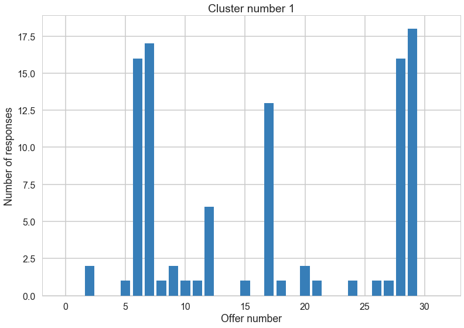

# Customer Segmentation using Clustering
***
This mini-project is based on [this blog post](http://blog.yhat.com/posts/customer-segmentation-using-python.html) by yhat. Please feel free to refer to the post for additional information, and solutions.


```
%matplotlib inline
import pandas as pd
import sklearn
import matplotlib.pyplot as plt
import seaborn as sns
import numpy as np

# Setup Seaborn
sns.set_style("whitegrid")
sns.set_context("poster")
```

## Data

The dataset contains information on marketing newsletters/e-mail campaigns (e-mail offers sent to customers) and transaction level data from customers. The transactional data shows which offer customers responded to, and what the customer ended up buying. The data is presented as an Excel workbook containing two worksheets. Each worksheet contains a different dataset.


```
path = '/Users/jason/svn/springboard/clustering/'
df_offers = pd.read_excel(path + "WineKMC.xlsx", sheetname=0)
df_offers.columns = ["offer_id", "campaign", "varietal", "min_qty", "discount", "origin", "past_peak"]
df_offers
```


<div>
<table border="1" class="dataframe">
  <thead>
    <tr style="text-align: right;">
      <th></th>
      <th>offer_id</th>
      <th>campaign</th>
      <th>varietal</th>
      <th>min_qty</th>
      <th>discount</th>
      <th>origin</th>
      <th>past_peak</th>
    </tr>
  </thead>
  <tbody>
    <tr>
      <th>0</th>
      <td>1</td>
      <td>January</td>
      <td>Malbec</td>
      <td>72</td>
      <td>56</td>
      <td>France</td>
      <td>False</td>
    </tr>
    <tr>
      <th>1</th>
      <td>2</td>
      <td>January</td>
      <td>Pinot Noir</td>
      <td>72</td>
      <td>17</td>
      <td>France</td>
      <td>False</td>
    </tr>
    <tr>
      <th>2</th>
      <td>3</td>
      <td>February</td>
      <td>Espumante</td>
      <td>144</td>
      <td>32</td>
      <td>Oregon</td>
      <td>True</td>
    </tr>
    <tr>
      <th>3</th>
      <td>4</td>
      <td>February</td>
      <td>Champagne</td>
      <td>72</td>
      <td>48</td>
      <td>France</td>
      <td>True</td>
    </tr>
    <tr>
      <th>4</th>
      <td>5</td>
      <td>February</td>
      <td>Cabernet Sauvignon</td>
      <td>144</td>
      <td>44</td>
      <td>New Zealand</td>
      <td>True</td>
    </tr>
    <tr>
      <th>5</th>
      <td>6</td>
      <td>March</td>
      <td>Prosecco</td>
      <td>144</td>
      <td>86</td>
      <td>Chile</td>
      <td>False</td>
    </tr>
    <tr>
      <th>6</th>
      <td>7</td>
      <td>March</td>
      <td>Prosecco</td>
      <td>6</td>
      <td>40</td>
      <td>Australia</td>
      <td>True</td>
    </tr>
    <tr>
      <th>7</th>
      <td>8</td>
      <td>March</td>
      <td>Espumante</td>
      <td>6</td>
      <td>45</td>
      <td>South Africa</td>
      <td>False</td>
    </tr>
    <tr>
      <th>8</th>
      <td>9</td>
      <td>April</td>
      <td>Chardonnay</td>
      <td>144</td>
      <td>57</td>
      <td>Chile</td>
      <td>False</td>
    </tr>
    <tr>
      <th>9</th>
      <td>10</td>
      <td>April</td>
      <td>Prosecco</td>
      <td>72</td>
      <td>52</td>
      <td>California</td>
      <td>False</td>
    </tr>
    <tr>
      <th>10</th>
      <td>11</td>
      <td>May</td>
      <td>Champagne</td>
      <td>72</td>
      <td>85</td>
      <td>France</td>
      <td>False</td>
    </tr>
    <tr>
      <th>11</th>
      <td>12</td>
      <td>May</td>
      <td>Prosecco</td>
      <td>72</td>
      <td>83</td>
      <td>Australia</td>
      <td>False</td>
    </tr>
    <tr>
      <th>12</th>
      <td>13</td>
      <td>May</td>
      <td>Merlot</td>
      <td>6</td>
      <td>43</td>
      <td>Chile</td>
      <td>False</td>
    </tr>
    <tr>
      <th>13</th>
      <td>14</td>
      <td>June</td>
      <td>Merlot</td>
      <td>72</td>
      <td>64</td>
      <td>Chile</td>
      <td>False</td>
    </tr>
    <tr>
      <th>14</th>
      <td>15</td>
      <td>June</td>
      <td>Cabernet Sauvignon</td>
      <td>144</td>
      <td>19</td>
      <td>Italy</td>
      <td>False</td>
    </tr>
    <tr>
      <th>15</th>
      <td>16</td>
      <td>June</td>
      <td>Merlot</td>
      <td>72</td>
      <td>88</td>
      <td>California</td>
      <td>False</td>
    </tr>
    <tr>
      <th>16</th>
      <td>17</td>
      <td>July</td>
      <td>Pinot Noir</td>
      <td>12</td>
      <td>47</td>
      <td>Germany</td>
      <td>False</td>
    </tr>
    <tr>
      <th>17</th>
      <td>18</td>
      <td>July</td>
      <td>Espumante</td>
      <td>6</td>
      <td>50</td>
      <td>Oregon</td>
      <td>False</td>
    </tr>
    <tr>
      <th>18</th>
      <td>19</td>
      <td>July</td>
      <td>Champagne</td>
      <td>12</td>
      <td>66</td>
      <td>Germany</td>
      <td>False</td>
    </tr>
    <tr>
      <th>19</th>
      <td>20</td>
      <td>August</td>
      <td>Cabernet Sauvignon</td>
      <td>72</td>
      <td>82</td>
      <td>Italy</td>
      <td>False</td>
    </tr>
    <tr>
      <th>20</th>
      <td>21</td>
      <td>August</td>
      <td>Champagne</td>
      <td>12</td>
      <td>50</td>
      <td>California</td>
      <td>False</td>
    </tr>
    <tr>
      <th>21</th>
      <td>22</td>
      <td>August</td>
      <td>Champagne</td>
      <td>72</td>
      <td>63</td>
      <td>France</td>
      <td>False</td>
    </tr>
    <tr>
      <th>22</th>
      <td>23</td>
      <td>September</td>
      <td>Chardonnay</td>
      <td>144</td>
      <td>39</td>
      <td>South Africa</td>
      <td>False</td>
    </tr>
    <tr>
      <th>23</th>
      <td>24</td>
      <td>September</td>
      <td>Pinot Noir</td>
      <td>6</td>
      <td>34</td>
      <td>Italy</td>
      <td>False</td>
    </tr>
    <tr>
      <th>24</th>
      <td>25</td>
      <td>October</td>
      <td>Cabernet Sauvignon</td>
      <td>72</td>
      <td>59</td>
      <td>Oregon</td>
      <td>True</td>
    </tr>
    <tr>
      <th>25</th>
      <td>26</td>
      <td>October</td>
      <td>Pinot Noir</td>
      <td>144</td>
      <td>83</td>
      <td>Australia</td>
      <td>False</td>
    </tr>
    <tr>
      <th>26</th>
      <td>27</td>
      <td>October</td>
      <td>Champagne</td>
      <td>72</td>
      <td>88</td>
      <td>New Zealand</td>
      <td>False</td>
    </tr>
    <tr>
      <th>27</th>
      <td>28</td>
      <td>November</td>
      <td>Cabernet Sauvignon</td>
      <td>12</td>
      <td>56</td>
      <td>France</td>
      <td>True</td>
    </tr>
    <tr>
      <th>28</th>
      <td>29</td>
      <td>November</td>
      <td>Pinot Grigio</td>
      <td>6</td>
      <td>87</td>
      <td>France</td>
      <td>False</td>
    </tr>
    <tr>
      <th>29</th>
      <td>30</td>
      <td>December</td>
      <td>Malbec</td>
      <td>6</td>
      <td>54</td>
      <td>France</td>
      <td>False</td>
    </tr>
    <tr>
      <th>30</th>
      <td>31</td>
      <td>December</td>
      <td>Champagne</td>
      <td>72</td>
      <td>89</td>
      <td>France</td>
      <td>False</td>
    </tr>
    <tr>
      <th>31</th>
      <td>32</td>
      <td>December</td>
      <td>Cabernet Sauvignon</td>
      <td>72</td>
      <td>45</td>
      <td>Germany</td>
      <td>True</td>
    </tr>
  </tbody>
</table>
</div>


We see that the first dataset contains information about each offer such as the month it is in effect and several attributes about the wine that the offer refers to: the variety, minimum quantity, discount, country of origin and whether or not it is past peak. The second dataset in the second worksheet contains transactional data -- which offer each customer responded to.


```
df_transactions = pd.read_excel(path + "WineKMC.xlsx", sheetname=1)
df_transactions.columns = ["customer_name", "offer_id"]
df_transactions['n'] = 1
df_transactions.head()
```


<div>
<table border="1" class="dataframe">
  <thead>
    <tr style="text-align: right;">
      <th></th>
      <th>customer_name</th>
      <th>offer_id</th>
      <th>n</th>
    </tr>
  </thead>
  <tbody>
    <tr>
      <th>0</th>
      <td>Smith</td>
      <td>2</td>
      <td>1</td>
    </tr>
    <tr>
      <th>1</th>
      <td>Smith</td>
      <td>24</td>
      <td>1</td>
    </tr>
    <tr>
      <th>2</th>
      <td>Johnson</td>
      <td>17</td>
      <td>1</td>
    </tr>
    <tr>
      <th>3</th>
      <td>Johnson</td>
      <td>24</td>
      <td>1</td>
    </tr>
    <tr>
      <th>4</th>
      <td>Johnson</td>
      <td>26</td>
      <td>1</td>
    </tr>
  </tbody>
</table>
</div>


## Data wrangling

We're trying to learn more about how our customers behave, so we can use their behavior (whether or not they purchased something based on an offer) as a way to group similar minded customers together. We can then study those groups to look for patterns and trends which can help us formulate future offers.

The first thing we need is a way to compare customers. To do this, we're going to create a matrix that contains each customer and a 0/1 indicator for whether or not they responded to a given offer. 

<div class="span5 alert alert-info">
<h3>Checkup Exercise Set I</h3>

<p><b>Exercise:</b> Create a data frame where each row has the following columns (Use the pandas [`merge`](http://pandas.pydata.org/pandas-docs/stable/generated/pandas.DataFrame.merge.html) and [`pivot_table`](http://pandas.pydata.org/pandas-docs/stable/generated/pandas.pivot_table.html) functions for this purpose):
<ul>
<li> customer_name
<li> One column for each offer, with a 1 if the customer responded to the offer
</ul>
<p>Make sure you also deal with any weird values such as `NaN`. Read the documentation to develop your solution.</p>
</div>


```
#your turn
df_merge = df_transactions.merge(df_offers, on='offer_id')
df_merge.head()
```


<div>
<table border="1" class="dataframe">
  <thead>
    <tr style="text-align: right;">
      <th></th>
      <th>customer_name</th>
      <th>offer_id</th>
      <th>n</th>
      <th>campaign</th>
      <th>varietal</th>
      <th>min_qty</th>
      <th>discount</th>
      <th>origin</th>
      <th>past_peak</th>
    </tr>
  </thead>
  <tbody>
    <tr>
      <th>0</th>
      <td>Smith</td>
      <td>2</td>
      <td>1</td>
      <td>January</td>
      <td>Pinot Noir</td>
      <td>72</td>
      <td>17</td>
      <td>France</td>
      <td>False</td>
    </tr>
    <tr>
      <th>1</th>
      <td>Rodriguez</td>
      <td>2</td>
      <td>1</td>
      <td>January</td>
      <td>Pinot Noir</td>
      <td>72</td>
      <td>17</td>
      <td>France</td>
      <td>False</td>
    </tr>
    <tr>
      <th>2</th>
      <td>Martin</td>
      <td>2</td>
      <td>1</td>
      <td>January</td>
      <td>Pinot Noir</td>
      <td>72</td>
      <td>17</td>
      <td>France</td>
      <td>False</td>
    </tr>
    <tr>
      <th>3</th>
      <td>Jackson</td>
      <td>2</td>
      <td>1</td>
      <td>January</td>
      <td>Pinot Noir</td>
      <td>72</td>
      <td>17</td>
      <td>France</td>
      <td>False</td>
    </tr>
    <tr>
      <th>4</th>
      <td>Campbell</td>
      <td>2</td>
      <td>1</td>
      <td>January</td>
      <td>Pinot Noir</td>
      <td>72</td>
      <td>17</td>
      <td>France</td>
      <td>False</td>
    </tr>
  </tbody>
</table>
</div>


```
table = pd.pivot_table(df_merge, values='n', index='customer_name', columns='offer_id', fill_value=0)
table.head()
```


<div>
<table border="1" class="dataframe">
  <thead>
    <tr style="text-align: right;">
      <th>offer_id</th>
      <th>1</th>
      <th>2</th>
      <th>3</th>
      <th>4</th>
      <th>5</th>
      <th>6</th>
      <th>7</th>
      <th>8</th>
      <th>9</th>
      <th>10</th>
      <th>...</th>
      <th>23</th>
      <th>24</th>
      <th>25</th>
      <th>26</th>
      <th>27</th>
      <th>28</th>
      <th>29</th>
      <th>30</th>
      <th>31</th>
      <th>32</th>
    </tr>
    <tr>
      <th>customer_name</th>
      <th></th>
      <th></th>
      <th></th>
      <th></th>
      <th></th>
      <th></th>
      <th></th>
      <th></th>
      <th></th>
      <th></th>
      <th></th>
      <th></th>
      <th></th>
      <th></th>
      <th></th>
      <th></th>
      <th></th>
      <th></th>
      <th></th>
      <th></th>
      <th></th>
    </tr>
  </thead>
  <tbody>
    <tr>
      <th>Adams</th>
      <td>0</td>
      <td>0</td>
      <td>0</td>
      <td>0</td>
      <td>0</td>
      <td>0</td>
      <td>0</td>
      <td>0</td>
      <td>0</td>
      <td>0</td>
      <td>...</td>
      <td>0</td>
      <td>0</td>
      <td>0</td>
      <td>0</td>
      <td>0</td>
      <td>0</td>
      <td>1</td>
      <td>1</td>
      <td>0</td>
      <td>0</td>
    </tr>
    <tr>
      <th>Allen</th>
      <td>0</td>
      <td>0</td>
      <td>0</td>
      <td>0</td>
      <td>0</td>
      <td>0</td>
      <td>0</td>
      <td>0</td>
      <td>1</td>
      <td>0</td>
      <td>...</td>
      <td>0</td>
      <td>0</td>
      <td>0</td>
      <td>0</td>
      <td>1</td>
      <td>0</td>
      <td>0</td>
      <td>0</td>
      <td>0</td>
      <td>0</td>
    </tr>
    <tr>
      <th>Anderson</th>
      <td>0</td>
      <td>0</td>
      <td>0</td>
      <td>0</td>
      <td>0</td>
      <td>0</td>
      <td>0</td>
      <td>0</td>
      <td>0</td>
      <td>0</td>
      <td>...</td>
      <td>0</td>
      <td>1</td>
      <td>0</td>
      <td>1</td>
      <td>0</td>
      <td>0</td>
      <td>0</td>
      <td>0</td>
      <td>0</td>
      <td>0</td>
    </tr>
    <tr>
      <th>Bailey</th>
      <td>0</td>
      <td>0</td>
      <td>0</td>
      <td>0</td>
      <td>0</td>
      <td>0</td>
      <td>1</td>
      <td>0</td>
      <td>0</td>
      <td>0</td>
      <td>...</td>
      <td>0</td>
      <td>0</td>
      <td>0</td>
      <td>0</td>
      <td>0</td>
      <td>0</td>
      <td>0</td>
      <td>1</td>
      <td>0</td>
      <td>0</td>
    </tr>
    <tr>
      <th>Baker</th>
      <td>0</td>
      <td>0</td>
      <td>0</td>
      <td>0</td>
      <td>0</td>
      <td>0</td>
      <td>1</td>
      <td>0</td>
      <td>0</td>
      <td>1</td>
      <td>...</td>
      <td>0</td>
      <td>0</td>
      <td>0</td>
      <td>0</td>
      <td>0</td>
      <td>0</td>
      <td>0</td>
      <td>0</td>
      <td>1</td>
      <td>0</td>
    </tr>
  </tbody>
</table>
<p>5 rows × 32 columns</p>
</div>


## K-Means Clustering

Recall that in K-Means Clustering we want to *maximize* the distance between centroids and *minimize* the distance between data points and the respective centroid for the cluster they are in. True evaluation for unsupervised learning would require labeled data; however, we can use a variety of intuitive metrics to try to pick the number of clusters K. We will introduce two methods: the Elbow method, the Silhouette method and the gap statistic.

### Choosing K: The Elbow Sum-of-Squares Method

The first method looks at the sum-of-squares error in each cluster against $K$. We compute the distance from each data point to the center of the cluster (centroid) to which the data point was assigned. 

$$SS = \sum_k \sum_{x_i \in C_k} \sum_{x_j \in C_k} \left( x_i - x_j \right)^2 = \sum_k \sum_{x_i \in C_k} \left( x_i - \mu_k \right)^2$$

where $x_i$ is a point, $C_k$ represents cluster $k$ and $\mu_k$ is the centroid for cluster $k$. We can plot SS vs. $K$ and choose the *elbow point* in the plot as the best value for $K$. The elbow point is the point at which the plot starts descending much more slowly. 

<div class="span5 alert alert-info">
<h3>Checkup Exercise Set II</h3>

<p><b>Exercise:</b></p> 
<ul>
<li> What values of $SS$ do you believe represent better clusterings? Why?
<li> Create a numpy matrix `x_cols` with only the columns representing the offers (i.e. the 0/1 colums) 
<li> Write code that applies the [`KMeans`](http://scikit-learn.org/stable/modules/generated/sklearn.cluster.KMeans.html) clustering method from scikit-learn to this matrix. 
<li> Construct a plot showing $SS$ for each $K$ and pick $K$ using this plot. For simplicity, test $2 \le K \le 10$.
<li> Make a bar chart showing the number of points in each cluster for k-means under the best $K$.
<li> What challenges did you experience using the Elbow method to pick $K$?
</ul>
</div>


```
# your turn
def ssq(x, clf):
    out = 0
    for i in range(x.shape[0]):
        # Sum of squared difference between each observation
        # and the cluster center it was assigned to
        out += np.sum((x[i,] - clf.cluster_centers_[clf.labels_[i]]) ** 2)
        
    return out
        
from sklearn.cluster import KMeans
x_cols = np.array(table)


# List to hold ssq results for each k
ssq_k = []

# The k values we will check
ks = np.arange(2, 11, 1)

# Fit KMeans model for each k and compute sum of squares
for i in ks:
    clf = KMeans(n_clusters=i).fit(x_cols)
    ssq_k.append(ssq(x_cols, clf))
    
sns.plt.plot(ks, ssq_k)
sns.plt.ylabel('Sum of squared differences')
sns.plt.xlabel('Number of clusters')
```


    <matplotlib.text.Text at 0x118812c10>


```
k = 3;
clf = KMeans(n_clusters=k).fit(x_cols)
n = []
ks = np.arange(k)
for i in ks:
    n.append(np.sum(clf.labels_ == i))
    
sns.plt.bar(ks,n)
plt.xlabel('Cluster number')
plt.ylabel('Number of customers')
```


    <matplotlib.text.Text at 0x118b6ee10>


#### Challenges with elbow method
With this particular dataset and the k-means algorithm, there was not a clear 'elbow' location at which to choose 'k'. It seemed very arbitrary.

### Choosing K: The Silhouette Method

There exists another method that measures how well each datapoint $x_i$ "fits" its assigned cluster *and also* how poorly it fits into other clusters. This is a different way of looking at the same objective. Denote $a_{x_i}$ as the *average* distance from $x_i$ to all other points within its own cluster $k$. The lower the value, the better. On the other hand $b_{x_i}$ is the minimum average distance from $x_i$ to points in a different cluster, minimized over clusters. That is, compute separately for each cluster the average distance from $x_i$ to the points within that cluster, and then take the minimum. The silhouette $s(x_i)$ is defined as

$$s(x_i) = \frac{b_{x_i} - a_{x_i}}{\max{\left( a_{x_i}, b_{x_i}\right)}}$$

The silhouette score is computed on *every datapoint in every cluster*. The silhouette score ranges from -1 (a poor clustering) to +1 (a very dense clustering) with 0 denoting the situation where clusters overlap. Some criteria for the silhouette coefficient is provided in the table below.

<pre>

| Range       | Interpretation                                |
|-------------|-----------------------------------------------|
| 0.71 - 1.0  | A strong structure has been found.            |
| 0.51 - 0.7  | A reasonable structure has been found.        |
| 0.26 - 0.5  | The structure is weak and could be artificial.|
| < 0.25      | No substantial structure has been found.      |

</pre>
Source: http://www.stat.berkeley.edu/~spector/s133/Clus.html

Fortunately, scikit-learn provides a function to compute this for us (phew!) called [`sklearn.metrics.silhouette_score`](http://scikit-learn.org/stable/modules/generated/sklearn.metrics.silhouette_score.html). Take a look at [this article](http://scikit-learn.org/stable/auto_examples/cluster/plot_kmeans_silhouette_analysis.html) on picking $K$ in scikit-learn, as it will help you in the next exercise set.

<div class="span5 alert alert-info">
<h3>Checkup Exercise Set III</h3>

<p><b>Exercise:</b> Using the documentation for the `silhouette_score` function above, construct a series of silhouette plots like the ones in the article linked above.</p>

<p><b>Exercise:</b> Compute the average silhouette score for each $K$ and plot it. What $K$ does the plot suggest we should choose? Does it differ from what we found using the Elbow method?</p>
</div>


```
# Your turn.
import matplotlib.cm as cm
from sklearn.metrics import silhouette_samples, silhouette_score
ks = np.arange(2, 9)

for k in ks:
    fig, ax1 = plt.subplots(1)
    ax1.set_xlim([-0.25, 1])
    ax1.set_ylim([0, len(x_cols) + (k + 1) * 10])
    
    clf = KMeans(n_clusters=k, random_state=777).fit(x_cols)
    cluster_labels = clf.labels_
    
    sil_avg = silhouette_score(x_cols, cluster_labels)
    print('Average silhouette score: k='+str(k)+' '+str(sil_avg))
    
    smpl_sil_score = silhouette_samples(x_cols, cluster_labels)
    
    y_lower = 10
    
    for i in range(k):
        ith_cluster_sil_score = smpl_sil_score[cluster_labels == i]
        ith_cluster_sil_score.sort()
        
        sz_cluster_i = ith_cluster_sil_score.shape[0]
        y_upper = y_lower + sz_cluster_i
        
        color = cm.spectral(float(i) / k)
        ax1.fill_betweenx(np.arange(y_lower, y_upper), 0, ith_cluster_sil_score, facecolor=color, edgecolor=color, alpha=0.7)
        
        ax1.text(-0.05, y_lower + 0.5 * sz_cluster_i, str(i))
        
        y_lower = y_upper + 10
        
    ax1.axvline(x=sil_avg, color='red', linestyle="--")
    ax1.set_yticks([])
    ax1.set_ylabel('Cluster label')
    ax1.set_xlabel('Silhouette coefficients')
        
plt.show()
        

```

    Average silhouette score: k=2 0.082278139724
    Average silhouette score: k=3 0.12133064284
    Average silhouette score: k=4 0.119351844012
    Average silhouette score: k=5 0.110043045377
    Average silhouette score: k=6 0.0964793007721
    Average silhouette score: k=7 0.132168634022
    Average silhouette score: k=8 0.127728176301


### Answer
The sillhouette plot does not give us strong confidence in any of the options for the number of clusters. Based upon the sillhouette plots, it seems that there may be some valid clusters in the data, but much of the data points are not really in a cluster, but rather outside of the clusters.

### Choosing $K$: The Gap Statistic

There is one last method worth covering for picking $K$, the so-called Gap statistic. The computation for the gap statistic builds on the sum-of-squares established in the Elbow method discussion, and compares it to the sum-of-squares of a "null distribution," that is, a random set of points with no clustering. The estimate for the optimal number of clusters $K$ is the value for which $\log{SS}$ falls the farthest below that of the reference distribution:

$$G_k = E_n^*\{\log SS_k\} - \log SS_k$$

In other words a good clustering yields a much larger difference between the reference distribution and the clustered data. The reference distribution is a Monte Carlo (randomization) procedure that constructs $B$ random distributions of points within the bounding box (limits) of the original data and then applies K-means to this synthetic distribution of data points.. $E_n^*\{\log SS_k\}$ is just the average $SS_k$ over all $B$ replicates. We then compute the standard deviation $\sigma_{SS}$ of the values of $SS_k$ computed from the $B$ replicates of the reference distribution and compute

$$s_k = \sqrt{1+1/B}\sigma_{SS}$$

Finally, we choose $K=k$ such that $G_k \geq G_{k+1} - s_{k+1}$.

### Aside: Choosing $K$ when we Have Labels

Unsupervised learning expects that we do not have the labels. In some situations, we may wish to cluster data that is labeled. Computing the optimal number of clusters is much easier if we have access to labels. There are several methods available. We will not go into the math or details since it is rare to have access to the labels, but we provide the names and references of these measures.

* Adjusted Rand Index
* Mutual Information
* V-Measure
* Fowlkes–Mallows index

See [this article](http://scikit-learn.org/stable/modules/clustering.html) for more information about these metrics.

## Visualizing Clusters using PCA

How do we visualize clusters? If we only had two features, we could likely plot the data as is. But we have 100 data points each containing 32 features (dimensions). Principal Component Analysis (PCA) will help us reduce the dimensionality of our data from 32 to something lower. For a visualization on the coordinate plane, we will use 2 dimensions. In this exercise, we're going to use it to transform our multi-dimensional dataset into a 2 dimensional dataset.

This is only one use of PCA for dimension reduction. We can also use PCA when we want to perform regression but we have a set of highly correlated variables. PCA untangles these correlations into a smaller number of features/predictors all of which are orthogonal (not correlated). PCA is also used to reduce a large set of variables into a much smaller one.

<div class="span5 alert alert-info">
<h3>Checkup Exercise Set IV</h3>

<p><b>Exercise:</b> Use PCA to plot your clusters:</p>

<ul>
<li> Use scikit-learn's [`PCA`](http://scikit-learn.org/stable/modules/generated/sklearn.decomposition.PCA.html) function to reduce the dimensionality of your clustering data to 2 components
<li> Create a data frame with the following fields:
  <ul>
  <li> customer name
  <li> cluster id the customer belongs to
  <li> the two PCA components (label them `x` and `y`)
  </ul>
<li> Plot a scatterplot of the `x` vs `y` columns
<li> Color-code points differently based on cluster ID
<li> How do the clusters look? 
<li> Based on what you see, what seems to be the best value for $K$? Moreover, which method of choosing $K$ seems to have produced the optimal result visually?
</ul>

<p><b>Exercise:</b> Now look at both the original raw data about the offers and transactions and look at the fitted clusters. Tell a story about the clusters in context of the original data. For example, do the clusters correspond to wine variants or something else interesting?</p>
</div>


```
#your turn
from sklearn.decomposition import PCA

clf_pca = PCA(n_components=2)
x_cols_pca = clf_pca.fit_transform(x_cols)

df_pca = pd.DataFrame(table.index)
df_pca['x'] = x_cols_pca[:,0]
df_pca['y'] = x_cols_pca[:,1]

ks = np.arange(2,6)
clrs = [ "#ff7f00",
"#377eb8",
"#4daf4a",
"#984ea3",
"#e41a1c"
]
for k in ks:
    clf = KMeans(n_clusters=k, random_state=777).fit(x_cols)
    cluster_labels = clf.labels_


    for i in range(k):
        ax = plt.gca()
        ax.set_axis_bgcolor('#FFFFFF')
        sns.plt.scatter(df_pca.x[cluster_labels == i], df_pca.y[cluster_labels == i], color=clrs[i])
        plt.title(str(k)+' clusters')
        
    
    plt.show()
```

    /Users/jason/anaconda/lib/python2.7/site-packages/ipykernel/__main__.py:25: MatplotlibDeprecationWarning: The set_axis_bgcolor function was deprecated in version 2.0. Use set_facecolor instead.


What we've done is we've taken those columns of 0/1 indicator variables, and we've transformed them into a 2-D dataset. We took one column and arbitrarily called it `x` and then called the other `y`. Now we can throw each point into a scatterplot. We color coded each point based on it's cluster so it's easier to see them.

### Did the cluster members respond to any ads in disproportionate numbers?


```
clf = KMeans(n_clusters=3, random_state=777).fit(x_cols)
cluster_labels = clf.labels_
table['cluster'] = cluster_labels
x = np.arange(0, 32)
for i in range(3):
    df_offers['cluster_'+str(i)] = np.sum(np.array(table[table.cluster == i]), 0)[0:32]
    plt.bar(x, np.sum(np.array(table[table.cluster == i]), 0)[0:32], color=clrs[i])
    plt.title('Cluster number ' + str(i))
    plt.xlabel('Offer number')
    plt.ylabel('Number of responses')
    plt.show()
```





```
df_offers
```


<div>
<table border="1" class="dataframe">
  <thead>
    <tr style="text-align: right;">
      <th></th>
      <th>offer_id</th>
      <th>campaign</th>
      <th>varietal</th>
      <th>min_qty</th>
      <th>discount</th>
      <th>origin</th>
      <th>past_peak</th>
      <th>cluster_0</th>
      <th>cluster_1</th>
      <th>cluster_2</th>
    </tr>
  </thead>
  <tbody>
    <tr>
      <th>0</th>
      <td>1</td>
      <td>January</td>
      <td>Malbec</td>
      <td>72</td>
      <td>56</td>
      <td>France</td>
      <td>False</td>
      <td>9</td>
      <td>0</td>
      <td>1</td>
    </tr>
    <tr>
      <th>1</th>
      <td>2</td>
      <td>January</td>
      <td>Pinot Noir</td>
      <td>72</td>
      <td>17</td>
      <td>France</td>
      <td>False</td>
      <td>4</td>
      <td>0</td>
      <td>6</td>
    </tr>
    <tr>
      <th>2</th>
      <td>3</td>
      <td>February</td>
      <td>Espumante</td>
      <td>144</td>
      <td>32</td>
      <td>Oregon</td>
      <td>True</td>
      <td>4</td>
      <td>2</td>
      <td>0</td>
    </tr>
    <tr>
      <th>3</th>
      <td>4</td>
      <td>February</td>
      <td>Champagne</td>
      <td>72</td>
      <td>48</td>
      <td>France</td>
      <td>True</td>
      <td>12</td>
      <td>0</td>
      <td>0</td>
    </tr>
    <tr>
      <th>4</th>
      <td>5</td>
      <td>February</td>
      <td>Cabernet Sauvignon</td>
      <td>144</td>
      <td>44</td>
      <td>New Zealand</td>
      <td>True</td>
      <td>4</td>
      <td>0</td>
      <td>0</td>
    </tr>
    <tr>
      <th>5</th>
      <td>6</td>
      <td>March</td>
      <td>Prosecco</td>
      <td>144</td>
      <td>86</td>
      <td>Chile</td>
      <td>False</td>
      <td>11</td>
      <td>1</td>
      <td>0</td>
    </tr>
    <tr>
      <th>6</th>
      <td>7</td>
      <td>March</td>
      <td>Prosecco</td>
      <td>6</td>
      <td>40</td>
      <td>Australia</td>
      <td>True</td>
      <td>3</td>
      <td>16</td>
      <td>0</td>
    </tr>
    <tr>
      <th>7</th>
      <td>8</td>
      <td>March</td>
      <td>Espumante</td>
      <td>6</td>
      <td>45</td>
      <td>South Africa</td>
      <td>False</td>
      <td>3</td>
      <td>17</td>
      <td>0</td>
    </tr>
    <tr>
      <th>8</th>
      <td>9</td>
      <td>April</td>
      <td>Chardonnay</td>
      <td>144</td>
      <td>57</td>
      <td>Chile</td>
      <td>False</td>
      <td>9</td>
      <td>1</td>
      <td>0</td>
    </tr>
    <tr>
      <th>9</th>
      <td>10</td>
      <td>April</td>
      <td>Prosecco</td>
      <td>72</td>
      <td>52</td>
      <td>California</td>
      <td>False</td>
      <td>4</td>
      <td>2</td>
      <td>1</td>
    </tr>
    <tr>
      <th>10</th>
      <td>11</td>
      <td>May</td>
      <td>Champagne</td>
      <td>72</td>
      <td>85</td>
      <td>France</td>
      <td>False</td>
      <td>12</td>
      <td>1</td>
      <td>0</td>
    </tr>
    <tr>
      <th>11</th>
      <td>12</td>
      <td>May</td>
      <td>Prosecco</td>
      <td>72</td>
      <td>83</td>
      <td>Australia</td>
      <td>False</td>
      <td>3</td>
      <td>1</td>
      <td>1</td>
    </tr>
    <tr>
      <th>12</th>
      <td>13</td>
      <td>May</td>
      <td>Merlot</td>
      <td>6</td>
      <td>43</td>
      <td>Chile</td>
      <td>False</td>
      <td>0</td>
      <td>6</td>
      <td>0</td>
    </tr>
    <tr>
      <th>13</th>
      <td>14</td>
      <td>June</td>
      <td>Merlot</td>
      <td>72</td>
      <td>64</td>
      <td>Chile</td>
      <td>False</td>
      <td>9</td>
      <td>0</td>
      <td>0</td>
    </tr>
    <tr>
      <th>14</th>
      <td>15</td>
      <td>June</td>
      <td>Cabernet Sauvignon</td>
      <td>144</td>
      <td>19</td>
      <td>Italy</td>
      <td>False</td>
      <td>6</td>
      <td>0</td>
      <td>0</td>
    </tr>
    <tr>
      <th>15</th>
      <td>16</td>
      <td>June</td>
      <td>Merlot</td>
      <td>72</td>
      <td>88</td>
      <td>California</td>
      <td>False</td>
      <td>3</td>
      <td>1</td>
      <td>1</td>
    </tr>
    <tr>
      <th>16</th>
      <td>17</td>
      <td>July</td>
      <td>Pinot Noir</td>
      <td>12</td>
      <td>47</td>
      <td>Germany</td>
      <td>False</td>
      <td>0</td>
      <td>0</td>
      <td>7</td>
    </tr>
    <tr>
      <th>17</th>
      <td>18</td>
      <td>July</td>
      <td>Espumante</td>
      <td>6</td>
      <td>50</td>
      <td>Oregon</td>
      <td>False</td>
      <td>1</td>
      <td>13</td>
      <td>0</td>
    </tr>
    <tr>
      <th>18</th>
      <td>19</td>
      <td>July</td>
      <td>Champagne</td>
      <td>12</td>
      <td>66</td>
      <td>Germany</td>
      <td>False</td>
      <td>4</td>
      <td>1</td>
      <td>0</td>
    </tr>
    <tr>
      <th>19</th>
      <td>20</td>
      <td>August</td>
      <td>Cabernet Sauvignon</td>
      <td>72</td>
      <td>82</td>
      <td>Italy</td>
      <td>False</td>
      <td>6</td>
      <td>0</td>
      <td>0</td>
    </tr>
    <tr>
      <th>20</th>
      <td>21</td>
      <td>August</td>
      <td>Champagne</td>
      <td>12</td>
      <td>50</td>
      <td>California</td>
      <td>False</td>
      <td>2</td>
      <td>2</td>
      <td>0</td>
    </tr>
    <tr>
      <th>21</th>
      <td>22</td>
      <td>August</td>
      <td>Champagne</td>
      <td>72</td>
      <td>63</td>
      <td>France</td>
      <td>False</td>
      <td>20</td>
      <td>1</td>
      <td>0</td>
    </tr>
    <tr>
      <th>22</th>
      <td>23</td>
      <td>September</td>
      <td>Chardonnay</td>
      <td>144</td>
      <td>39</td>
      <td>South Africa</td>
      <td>False</td>
      <td>4</td>
      <td>0</td>
      <td>1</td>
    </tr>
    <tr>
      <th>23</th>
      <td>24</td>
      <td>September</td>
      <td>Pinot Noir</td>
      <td>6</td>
      <td>34</td>
      <td>Italy</td>
      <td>False</td>
      <td>0</td>
      <td>0</td>
      <td>12</td>
    </tr>
    <tr>
      <th>24</th>
      <td>25</td>
      <td>October</td>
      <td>Cabernet Sauvignon</td>
      <td>72</td>
      <td>59</td>
      <td>Oregon</td>
      <td>True</td>
      <td>5</td>
      <td>1</td>
      <td>0</td>
    </tr>
    <tr>
      <th>25</th>
      <td>26</td>
      <td>October</td>
      <td>Pinot Noir</td>
      <td>144</td>
      <td>83</td>
      <td>Australia</td>
      <td>False</td>
      <td>3</td>
      <td>0</td>
      <td>12</td>
    </tr>
    <tr>
      <th>26</th>
      <td>27</td>
      <td>October</td>
      <td>Champagne</td>
      <td>72</td>
      <td>88</td>
      <td>New Zealand</td>
      <td>False</td>
      <td>7</td>
      <td>1</td>
      <td>1</td>
    </tr>
    <tr>
      <th>27</th>
      <td>28</td>
      <td>November</td>
      <td>Cabernet Sauvignon</td>
      <td>12</td>
      <td>56</td>
      <td>France</td>
      <td>True</td>
      <td>5</td>
      <td>1</td>
      <td>0</td>
    </tr>
    <tr>
      <th>28</th>
      <td>29</td>
      <td>November</td>
      <td>Pinot Grigio</td>
      <td>6</td>
      <td>87</td>
      <td>France</td>
      <td>False</td>
      <td>1</td>
      <td>16</td>
      <td>0</td>
    </tr>
    <tr>
      <th>29</th>
      <td>30</td>
      <td>December</td>
      <td>Malbec</td>
      <td>6</td>
      <td>54</td>
      <td>France</td>
      <td>False</td>
      <td>4</td>
      <td>18</td>
      <td>0</td>
    </tr>
    <tr>
      <th>30</th>
      <td>31</td>
      <td>December</td>
      <td>Champagne</td>
      <td>72</td>
      <td>89</td>
      <td>France</td>
      <td>False</td>
      <td>17</td>
      <td>0</td>
      <td>0</td>
    </tr>
    <tr>
      <th>31</th>
      <td>32</td>
      <td>December</td>
      <td>Cabernet Sauvignon</td>
      <td>72</td>
      <td>45</td>
      <td>Germany</td>
      <td>True</td>
      <td>4</td>
      <td>0</td>
      <td>0</td>
    </tr>
  </tbody>
</table>
</div>


### Which cluster is purchasing what?

#### Cluster 2 seems does not appear willing to purchase wine that is past its peak

Though if we peak ahead to the next cell, we see that most of what they purchased is Pinot Noir. None of the offers for Pinot Noir were past peak. Given that 86% of the purchases from cluster 2 were Pinot Noir, the peak/past peak difference seems more likely related to the fact that none of the Pinot Noir offeres were past peak.


```
df_responses = df_offers[['cluster_0', 'cluster_1', 'cluster_2']]
df_offers_c0 = df_offers[df_offers.cluster_0 > 0]
df_offers_c1 = df_offers[df_offers.cluster_1 > 0]
df_offers_c2 = df_offers[df_offers.cluster_2 > 0]

def f(variable):
    return df_responses[df_offers[variable]]

def percent_purchase(variable, f):
    response_sum = np.sum(df_responses)
    tmp = f(variable)
    print 'Percent ' + variable + '\n' + '-'*24
    print str(np.sum(tmp) / np.sum(df_responses))
    
percent_purchase('past_peak', f)
```

    Percent past_peak
    ------------------------
    cluster_0    0.206704
    cluster_1    0.196078
    cluster_2    0.000000
    dtype: float64


#### Cluster 2 seems to like Pinot Noir and Cluster 0 seems to like Champagne and sparkling wine


```
varietal = df_offers.varietal.drop_duplicates()

def f_varietal(v):
    return df_responses[df_offers['varietal'] == v]

for v in varietal:
    percent_purchase(v, f_varietal)
    print '\n'

```

    Percent Malbec
    ------------------------
    cluster_0    0.072626
    cluster_1    0.176471
    cluster_2    0.023256
    dtype: float64
    
    
    Percent Pinot Noir
    ------------------------
    cluster_0    0.039106
    cluster_1    0.000000
    cluster_2    0.860465
    dtype: float64
    
    
    Percent Espumante
    ------------------------
    cluster_0    0.044693
    cluster_1    0.313725
    cluster_2    0.000000
    dtype: float64
    
    
    Percent Champagne
    ------------------------
    cluster_0    0.413408
    cluster_1    0.058824
    cluster_2    0.023256
    dtype: float64
    
    
    Percent Cabernet Sauvignon
    ------------------------
    cluster_0    0.167598
    cluster_1    0.019608
    cluster_2    0.000000
    dtype: float64
    
    
    Percent Prosecco
    ------------------------
    cluster_0    0.117318
    cluster_1    0.196078
    cluster_2    0.046512
    dtype: float64
    
    
    Percent Chardonnay
    ------------------------
    cluster_0    0.072626
    cluster_1    0.009804
    cluster_2    0.023256
    dtype: float64
    
    
    Percent Merlot
    ------------------------
    cluster_0    0.067039
    cluster_1    0.068627
    cluster_2    0.023256
    dtype: float64
    
    
    Percent Pinot Grigio
    ------------------------
    cluster_0    0.005587
    cluster_1    0.156863
    cluster_2    0.000000
    dtype: float64
    
    


```
location = df_offers.origin.drop_duplicates()

def f_origin(v):
    return df_responses[df_offers['origin'] == v]

for loc in location:
    percent_purchase(loc, f_origin)
    print '\n'
```

    Percent France
    ------------------------
    cluster_0    0.469274
    cluster_1    0.362745
    cluster_2    0.162791
    dtype: float64
    
    
    Percent Oregon
    ------------------------
    cluster_0    0.055866
    cluster_1    0.156863
    cluster_2    0.000000
    dtype: float64
    
    
    Percent New Zealand
    ------------------------
    cluster_0    0.061453
    cluster_1    0.009804
    cluster_2    0.023256
    dtype: float64
    
    
    Percent Chile
    ------------------------
    cluster_0    0.162011
    cluster_1    0.078431
    cluster_2    0.000000
    dtype: float64
    
    
    Percent Australia
    ------------------------
    cluster_0    0.050279
    cluster_1    0.166667
    cluster_2    0.302326
    dtype: float64
    
    
    Percent South Africa
    ------------------------
    cluster_0    0.039106
    cluster_1    0.166667
    cluster_2    0.023256
    dtype: float64
    
    
    Percent California
    ------------------------
    cluster_0    0.050279
    cluster_1    0.049020
    cluster_2    0.046512
    dtype: float64
    
    
    Percent Italy
    ------------------------
    cluster_0    0.067039
    cluster_1    0.000000
    cluster_2    0.279070
    dtype: float64
    
    
    Percent Germany
    ------------------------
    cluster_0    0.044693
    cluster_1    0.009804
    cluster_2    0.162791
    dtype: float64
    
    


<div class="span5 alert alert-info">
<h3>Exercise Set V</h3>

<p>As we saw earlier, PCA has a lot of other uses. Since we wanted to visualize our data in 2 dimensions, restricted the number of dimensions to 2 in PCA. But what is the true optimal number of dimensions?</p>

<p><b>Exercise:</b> Using a new PCA object shown in the next cell, plot the `explained_variance_` field and look for the elbow point, the point where the curve's rate of descent seems to slow sharply. This value is one possible value for the optimal number of dimensions. What is it?</p>
</div>


```
#your turn
# Initialize a new PCA model with a default number of components.
import sklearn.decomposition
pca = sklearn.decomposition.PCA()
pca.fit(x_cols)

# Do the rest on your own :)
plt.scatter(range(pca.explained_variance_.shape[0]),pca.explained_variance_)
plt.plot(range(pca.explained_variance_.shape[0]),pca.explained_variance_)
plt.axvline(4, color="orange")
plt.text(4.5, 0.15, 'Elbow at 4 principal components')
plt.xlabel('Number of principal components')
plt.ylabel('Percent variance explained')
```


    <matplotlib.text.Text at 0x11a8904d0>


## Other Clustering Algorithms

k-means is only one of a ton of clustering algorithms. Below is a brief description of several clustering algorithms, and the table provides references to the other clustering algorithms in scikit-learn. 

* **Affinity Propagation** does not require the number of clusters $K$ to be known in advance! AP uses a "message passing" paradigm to cluster points based on their similarity. 

* **Spectral Clustering** uses the eigenvalues of a similarity matrix to reduce the dimensionality of the data before clustering in a lower dimensional space. This is tangentially similar to what we did to visualize k-means clusters using PCA. The number of clusters must be known a priori.

* **Ward's Method** applies to hierarchical clustering. Hierarchical clustering algorithms take a set of data and successively divide the observations into more and more clusters at each layer of the hierarchy. Ward's method is used to determine when two clusters in the hierarchy should be combined into one. It is basically an extension of hierarchical clustering. Hierarchical clustering is *divisive*, that is, all observations are part of the same cluster at first, and at each successive iteration, the clusters are made smaller and smaller. With hierarchical clustering, a hierarchy is constructed, and there is not really the concept of "number of clusters." The number of clusters simply determines how low or how high in the hierarchy we reference and can be determined empirically or by looking at the [dendogram](https://docs.scipy.org/doc/scipy-0.18.1/reference/generated/scipy.cluster.hierarchy.dendrogram.html).

* **Agglomerative Clustering** is similar to hierarchical clustering but but is not divisive, it is *agglomerative*. That is, every observation is placed into its own cluster and at each iteration or level or the hierarchy, observations are merged into fewer and fewer clusters until convergence. Similar to hierarchical clustering, the constructed hierarchy contains all possible numbers of clusters and it is up to the analyst to pick the number by reviewing statistics or the dendogram.

* **DBSCAN** is based on point density rather than distance. It groups together points with many nearby neighbors. DBSCAN is one of the most cited algorithms in the literature. It does not require knowing the number of clusters a priori, but does require specifying the neighborhood size.

### Clustering Algorithms in Scikit-learn
<table border="1">
<colgroup>
<col width="15%" />
<col width="16%" />
<col width="20%" />
<col width="27%" />
<col width="22%" />
</colgroup>
<thead valign="bottom">
<tr><th>Method name</th>
<th>Parameters</th>
<th>Scalability</th>
<th>Use Case</th>
<th>Geometry (metric used)</th>
</tr>
</thead>
<tbody valign="top">
<tr><td>K-Means</span></a></td>
<td>number of clusters</td>
<td>Very large<span class="pre">n_samples</span>, medium <span class="pre">n_clusters</span> with
MiniBatch code</td>
<td>General-purpose, even cluster size, flat geometry, not too many clusters</td>
<td>Distances between points</td>
</tr>
<tr><td>Affinity propagation</td>
<td>damping, sample preference</td>
<td>Not scalable with n_samples</td>
<td>Many clusters, uneven cluster size, non-flat geometry</td>
<td>Graph distance (e.g. nearest-neighbor graph)</td>
</tr>
<tr><td>Mean-shift</td>
<td>bandwidth</td>
<td>Not scalable with <span class="pre">n_samples</span></td>
<td>Many clusters, uneven cluster size, non-flat geometry</td>
<td>Distances between points</td>
</tr>
<tr><td>Spectral clustering</td>
<td>number of clusters</td>
<td>Medium <span class="pre">n_samples</span>, small <span class="pre">n_clusters</span></td>
<td>Few clusters, even cluster size, non-flat geometry</td>
<td>Graph distance (e.g. nearest-neighbor graph)</td>
</tr>
<tr><td>Ward hierarchical clustering</td>
<td>number of clusters</td>
<td>Large <span class="pre">n_samples</span> and <span class="pre">n_clusters</span></td>
<td>Many clusters, possibly connectivity constraints</td>
<td>Distances between points</td>
</tr>
<tr><td>Agglomerative clustering</td>
<td>number of clusters, linkage type, distance</td>
<td>Large <span class="pre">n_samples</span> and <span class="pre">n_clusters</span></td>
<td>Many clusters, possibly connectivity constraints, non Euclidean
distances</td>
<td>Any pairwise distance</td>
</tr>
<tr><td>DBSCAN</td>
<td>neighborhood size</td>
<td>Very large <span class="pre">n_samples</span>, medium <span class="pre">n_clusters</span></td>
<td>Non-flat geometry, uneven cluster sizes</td>
<td>Distances between nearest points</td>
</tr>
<tr><td>Gaussian mixtures</td>
<td>many</td>
<td>Not scalable</td>
<td>Flat geometry, good for density estimation</td>
<td>Mahalanobis distances to  centers</td>
</tr>
<tr><td>Birch</td>
<td>branching factor, threshold, optional global clusterer.</td>
<td>Large <span class="pre">n_clusters</span> and <span class="pre">n_samples</span></td>
<td>Large dataset, outlier removal, data reduction.</td>
<td>Euclidean distance between points</td>
</tr>
</tbody>
</table>
Source: http://scikit-learn.org/stable/modules/clustering.html

<div class="span5 alert alert-info">
<h3>Exercise Set VI</h3>

<p><b>Exercise:</b> Try clustering using the following algorithms. </p>
<ol>
<li>Affinity propagation
<li>Spectral clustering
<li>Agglomerative clustering
<li>DBSCAN
</ol>
<p>How do their results compare? Which performs the best? Tell a story why you think it performs the best.</p>
</div>


```
# Your turn
from sklearn.cluster import AffinityPropagation, DBSCAN, SpectralClustering, AgglomerativeClustering
clf_ap = AffinityPropagation().fit(x_cols)
clf_ap.cluster_centers_.shape[0]
```


    14


```
def sil_plot(ks, cluster_labels, t):
    for k in ks:
        fig, ax1 = plt.subplots(1)
        ax1.set_xlim([-0.25, 1])
        ax1.set_ylim([0, len(x_cols) + (k + 1) * 10])

        sil_avg = silhouette_score(x_cols, cluster_labels)
        print('Average silhouette score: k='+str(k)+' '+str(sil_avg))

        smpl_sil_score = silhouette_samples(x_cols, cluster_labels)

        y_lower = 10

        for i in range(k):
            ith_cluster_sil_score = smpl_sil_score[cluster_labels == i]
            ith_cluster_sil_score.sort()

            sz_cluster_i = ith_cluster_sil_score.shape[0]
            y_upper = y_lower + sz_cluster_i

            color = cm.spectral(float(i) / k)
            ax1.fill_betweenx(np.arange(y_lower, y_upper), 0, ith_cluster_sil_score, facecolor=color, edgecolor=color, alpha=0.7)

            ax1.text(-0.05, y_lower + 0.5 * sz_cluster_i, str(i))

            y_lower = y_upper + 10
        ax1.set_title(t)
        ax1.axvline(x=sil_avg, color='red', linestyle="--")
        ax1.set_yticks([])
        ax1.set_ylabel('Cluster label')
        ax1.set_xlabel('Silhouette coefficients')

    plt.show()

```


```
damping = 0.5
for foo in range(5):
    clf = AffinityPropagation(damping=damping).fit(x_cols)
    t = "Affinity Propgation"
    cluster_labels = clf.labels_
    i = np.unique(clf.labels_).shape[0]
    damping += 0.1

    sil_plot([i], cluster_labels, t)
    plt.show()
```

    Average silhouette score: k=14 0.123465236045


    Average silhouette score: k=14 0.123465236045


    Average silhouette score: k=14 0.123465236045


    Average silhouette score: k=11 0.0895455499989


    Average silhouette score: k=11 0.0895455499989


```
for i in range(7):
    cluster_labels = SpectralClustering(n_clusters=i+2).fit_predict(x_cols)
    sil_plot([i+2], cluster_labels, "SpectralClustering")
    plt.show()

```

    Average silhouette score: k=2 0.0591405970172


    Average silhouette score: k=3 0.0999059123102


    Average silhouette score: k=4 0.0290656989328


    Average silhouette score: k=5 0.0276162314543


    Average silhouette score: k=6 0.0175964169953


    Average silhouette score: k=7 0.0526931828711


    Average silhouette score: k=8 0.0526822430984


```
for i in range(7):
    cluster_labels = AgglomerativeClustering(n_clusters=i+2).fit_predict(x_cols)
    sil_plot([i+2], cluster_labels, "Agglomerative Clustering")
    plt.show()

```

    Average silhouette score: k=2 0.0854016288561


    Average silhouette score: k=3 0.116965699205


    Average silhouette score: k=4 0.13011921749


    Average silhouette score: k=5 0.14195353461


    Average silhouette score: k=6 0.147933025658


    Average silhouette score: k=7 0.110564298325


    Average silhouette score: k=8 0.118550842023


```
eps = 1
for foo in range(9):
    cluster_labels = DBSCAN(eps=eps).fit_predict(x_cols)
    i = np.unique(cluster_labels).shape[0]
    
    # Place all -1 labelled points in a separate class
    mask = cluster_labels == -1
    cluster_labels[mask] = i-1
    
    sil_plot([i], cluster_labels, "DBSCAN Clustering: eps = "+str(eps))
    eps += 0.1
    plt.show()
```

    Average silhouette score: k=5 0.0127152032749


    Average silhouette score: k=5 0.0127152032749


    Average silhouette score: k=5 0.0127152032749


    Average silhouette score: k=5 0.0127152032749


    Average silhouette score: k=5 0.0127152032749


    Average silhouette score: k=2 0.119898866858


    Average silhouette score: k=2 0.119898866858


    Average silhouette score: k=2 0.119898866858


    Average silhouette score: k=2 0.18020378233


Based upon the output above, it is difficult to determine which algorithm performs the best on this data. None of them seem to do very well with respect to average silhouette score. However, I think a reasonable interpretation would be that some clusters exist within the data, but not all of the data could reasonably be interpreted as in a cluster.

Given this interpretation, we might consider some of the spectral clustering or k-means outputs as successful if we only use certain groups with higher inside group silhouette coefficients and consider data points in the other clusters to be undetermined.

More data may also help to provide better direction.
