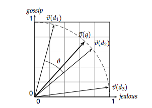
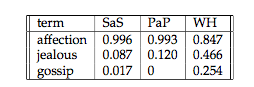

# Basic Text Classification with Naive Bayes
***
In the mini-project, you'll learn the basics of text analysis using a subset of movie reviews from the rotten tomatoes database. You'll also use a fundamental technique in Bayesian inference, called Naive Bayes. This mini-project is based on [Lab 10 of Harvard's CS109](https://github.com/cs109/2015lab10) class.  Please free to go to the original lab for additional exercises and solutions.


```python
%matplotlib inline
import numpy as np
import scipy as sp
import matplotlib as mpl
import matplotlib.cm as cm
import matplotlib.pyplot as plt
import pandas as pd
import seaborn as sns
from six.moves import range

# Setup Pandas
pd.set_option('display.width', 500)
pd.set_option('display.max_columns', 100)
pd.set_option('display.notebook_repr_html', True)

# Setup Seaborn
sns.set_style("whitegrid")
sns.set_context("poster")
```

# Table of Contents

* [Rotten Tomatoes Dataset](#Rotten-Tomatoes-Dataset)
    * [Explore](#Explore)
* [The Vector Space Model and a Search Engine](#The-Vector-Space-Model-and-a-Search-Engine)
    * [In Code](#In-Code)
* [Naive Bayes](#Naive-Bayes)
    * [Multinomial Naive Bayes and Other Likelihood Functions](#Multinomial-Naive-Bayes-and-Other-Likelihood-Functions)
    * [Picking Hyperparameters for Naive Bayes and Text Maintenance](#Picking-Hyperparameters-for-Naive-Bayes-and-Text-Maintenance)
* [Interpretation](#Interpretation)


## Rotten Tomatoes Dataset


```python
critics = pd.read_csv('/Users/jason/svn/springboard/naive_bayes/critics.csv')
#let's drop rows with missing quotes
critics = critics[~critics.quote.isnull()]
critics.head()
```


<div>
<table border="1" class="dataframe">
  <thead>
    <tr style="text-align: right;">
      <th></th>
      <th>critic</th>
      <th>fresh</th>
      <th>imdb</th>
      <th>publication</th>
      <th>quote</th>
      <th>review_date</th>
      <th>rtid</th>
      <th>title</th>
    </tr>
  </thead>
  <tbody>
    <tr>
      <th>1</th>
      <td>Derek Adams</td>
      <td>fresh</td>
      <td>114709</td>
      <td>Time Out</td>
      <td>So ingenious in concept, design and execution ...</td>
      <td>2009-10-04</td>
      <td>9559</td>
      <td>Toy story</td>
    </tr>
    <tr>
      <th>2</th>
      <td>Richard Corliss</td>
      <td>fresh</td>
      <td>114709</td>
      <td>TIME Magazine</td>
      <td>The year's most inventive comedy.</td>
      <td>2008-08-31</td>
      <td>9559</td>
      <td>Toy story</td>
    </tr>
    <tr>
      <th>3</th>
      <td>David Ansen</td>
      <td>fresh</td>
      <td>114709</td>
      <td>Newsweek</td>
      <td>A winning animated feature that has something ...</td>
      <td>2008-08-18</td>
      <td>9559</td>
      <td>Toy story</td>
    </tr>
    <tr>
      <th>4</th>
      <td>Leonard Klady</td>
      <td>fresh</td>
      <td>114709</td>
      <td>Variety</td>
      <td>The film sports a provocative and appealing st...</td>
      <td>2008-06-09</td>
      <td>9559</td>
      <td>Toy story</td>
    </tr>
    <tr>
      <th>5</th>
      <td>Jonathan Rosenbaum</td>
      <td>fresh</td>
      <td>114709</td>
      <td>Chicago Reader</td>
      <td>An entertaining computer-generated, hyperreali...</td>
      <td>2008-03-10</td>
      <td>9559</td>
      <td>Toy story</td>
    </tr>
  </tbody>
</table>
</div>


### Explore


```python
n_reviews = len(critics)
n_movies = critics.rtid.unique().size
n_critics = critics.critic.unique().size


print("Number of reviews: {:d}".format(n_reviews))
print("Number of critics: {:d}".format(n_critics))
print("Number of movies:  {:d}".format(n_movies))
```

    Number of reviews: 15561
    Number of critics: 623
    Number of movies:  1921


```python
df = critics.copy()
df['fresh'] = df.fresh == 'fresh'
grp = df.groupby('critic')
counts = grp.critic.count()  # number of reviews by each critic
means = grp.fresh.mean()     # average freshness for each critic

means[counts > 100].hist(bins=10, edgecolor='w', lw=1)
plt.xlabel("Average Rating per critic")
plt.ylabel("Number of Critics")
plt.yticks([0, 2, 4, 6, 8, 10]);
```


<div class="span5 alert alert-info">
<h3>Exercise Set I</h3>
<br/>
<b>Exercise:</b> Look at the histogram above. Tell a story about the average ratings per critic. What shape does the distribution look like? What is interesting about the distribution? What might explain these interesting things?
</div>

### Answer
The distribution appears to be bimodal. The most prominent section of the distribution starts around 60% 'fresh' and then decreases quickly as the 'average rating' approaches approximately 80% 'fresh'. The second prominence starts just above 50% 'fresh' and decreases in number until it reaches between 30-40% fresh.

There are likely many factors at work in the percentage of 'fresh' ratings by these critics. If a critic writes for only one publication, then the publication would be expected to have a large influence over the average rating of the critic. This influence could be exerted through the selection of movies that must be reviewed, and the particular perspective that the publication wants to publish. 

Each publication would be expected to review movies that their audience is most likely to be interested in and to desire to publish reviews that fit within the norm of their audience. This influence could be exerted explicitly with specific movie review assignments and review writing guidance, or through the hiring of a reviewer who naturally fits the goals of the publication.

I would expect that the negative average ratings come from reviewers and publications which cater to a more narrow audience. This population may either like a lower percentage of the movies released, or may prefer to be told that a movie they will like is bad, than to be told to expect to like a movie that they would not.

The section of the distribution with higher average reviews is likely more mainstream/popular reviewers and publications. It could also be that some of the reviewers suppress reviews or otherwise ignore some of the movies that they dislike.

This data does not have the answers to these questions, but can serve as a starting point for hypothesis generation. More research would be needed to provide answers with a higher level of certainty.

## The Vector Space Model and a Search Engine

All the diagrams here are snipped from [*Introduction to Information Retrieval* by Manning et. al.]( http://nlp.stanford.edu/IR-book/) which is a great resource on text processing. For additional information on text mining and natural language processing, see [*Foundations of Statistical Natural Language Processing* by Manning and Schutze](http://nlp.stanford.edu/fsnlp/).

Also check out Python packages [`nltk`](http://www.nltk.org/), [`spaCy`](https://spacy.io/), [`pattern`](http://www.clips.ua.ac.be/pattern), and their associated resources. Also see [`word2vec`](https://en.wikipedia.org/wiki/Word2vec).

Let us define the vector derived from document $d$ by $\bar V(d)$. What does this mean? Each document is treated as a vector containing information about the words contained in it. Each vector has the same length and each entry "slot" in the vector contains some kind of data about the words that appear in the document such as presence/absence (1/0), count (an integer) or some other statistic. Each vector has the same length because each document shared the same vocabulary across the full collection of documents -- this collection is called a *corpus*.

To define the vocabulary, we take a union of all words we have seen in all documents. We then just associate an array index with them. So "hello" may be at index 5 and "world" at index 99.

Suppose we have the following corpus:

`A Fox one day spied a beautiful bunch of ripe grapes hanging from a vine trained along the branches of a tree. The grapes seemed ready to burst with juice, and the Fox's mouth watered as he gazed longingly at them.`

Suppose we treat each sentence as a document $d$. The vocabulary (often called the *lexicon*) is the following:

$V = \left\{\right.$ `a, along, and, as, at, beautiful, branches, bunch, burst, day, fox, fox's, from, gazed, grapes, hanging, he, juice, longingly, mouth, of, one, ready, ripe, seemed, spied, the, them, to, trained, tree, vine, watered, with`$\left.\right\}$

Then the document

`A Fox one day spied a beautiful bunch of ripe grapes hanging from a vine trained along the branches of a tree`

may be represented as the following sparse vector of word counts:

$$\bar V(d) = \left( 4,1,0,0,0,1,1,1,0,1,1,0,1,0,1,1,0,0,0,0,2,1,0,1,0,0,1,0,0,0,1,1,0,0 \right)$$

or more succinctly as

`[(0, 4), (1, 1), (5, 1), (6, 1), (7, 1), (9, 1), (10, 1), (12, 1), (14, 1), (15, 1), (20, 2), (21, 1), (23, 1),`
`(26, 1), (30, 1), (31, 1)]`

along with a dictionary

``
{
    0: a, 1: along, 5: beautiful, 6: branches, 7: bunch, 9: day, 10: fox, 12: from, 14: grapes, 
    15: hanging, 19: mouth, 20: of, 21: one, 23: ripe, 24: seemed, 25: spied, 26: the, 
    30: tree, 31: vine, 
}
``

Then, a set of documents becomes, in the usual `sklearn` style, a sparse matrix with rows being sparse arrays representing documents and columns representing the features/words in the vocabulary.

Notice that this representation loses the relative ordering of the terms in the document. That is "cat ate rat" and "rat ate cat" are the same. Thus, this representation is also known as the Bag-Of-Words representation.

Here is another example, from the book quoted above, although the matrix is transposed here so that documents are columns:


Such a matrix is also catted a Term-Document Matrix. Here, the terms being indexed could be stemmed before indexing; for instance, `jealous` and `jealousy` after stemming are the same feature. One could also make use of other "Natural Language Processing" transformations in constructing the vocabulary. We could use Lemmatization, which reduces words to lemmas: work, working, worked would all reduce to work. We could remove "stopwords" from our vocabulary, such as common words like "the". We could look for particular parts of speech, such as adjectives. This is often done in Sentiment Analysis. And so on. It all depends on our application.

From the book:
>The standard way of quantifying the similarity between two documents $d_1$ and $d_2$  is to compute the cosine similarity of their vector representations $\bar V(d_1)$ and $\bar V(d_2)$:

$$S_{12} = \frac{\bar V(d_1) \cdot \bar V(d_2)}{|\bar V(d_1)| \times |\bar V(d_2)|}$$




>There is a far more compelling reason to represent documents as vectors: we can also view a query as a vector. Consider the query q = jealous gossip. This query turns into the unit vector $\bar V(q)$ = (0, 0.707, 0.707) on the three coordinates below. 



>The key idea now: to assign to each document d a score equal to the dot product:

$$\bar V(q) \cdot \bar V(d)$$

Then we can use this simple Vector Model as a Search engine.

### In Code


```python
from sklearn.feature_extraction.text import CountVectorizer

text = ['Hop on pop', 'Hop off pop', 'Hop Hop hop']
print("Original text is\n{}".format('\n'.join(text)))

vectorizer = CountVectorizer(min_df=0)

# call `fit` to build the vocabulary
vectorizer.fit(text)

# call `transform` to convert text to a bag of words
x = vectorizer.transform(text)

# CountVectorizer uses a sparse array to save memory, but it's easier in this assignment to 
# convert back to a "normal" numpy array
x = x.toarray()

print("")
print("Transformed text vector is \n{}".format(x))

# `get_feature_names` tracks which word is associated with each column of the transformed x
print("")
print("Words for each feature:")
print(vectorizer.get_feature_names())

# Notice that the bag of words treatment doesn't preserve information about the *order* of words, 
# just their frequency
```

    Original text is
    Hop on pop
    Hop off pop
    Hop Hop hop
    
    Transformed text vector is 
    [[1 0 1 1]
     [1 1 0 1]
     [3 0 0 0]]
    
    Words for each feature:
    [u'hop', u'off', u'on', u'pop']


```python
def make_xy(critics, vectorizer=None):
    #Your code here    
    if vectorizer is None:
        vectorizer = CountVectorizer()
    X = vectorizer.fit_transform(critics.quote)
    X = X.tocsc()  # some versions of sklearn return COO format
    y = (critics.fresh == 'fresh').values.astype(np.int)
    return X, y
X, y = make_xy(critics)
```

## Naive Bayes

From Bayes' Theorem, we have that

$$P(c \vert f) = \frac{P(c \cap f)}{P(f)}$$

where $c$ represents a *class* or category, and $f$ represents a feature vector, such as $\bar V(d)$ as above. **We are computing the probability that a document (or whatever we are classifying) belongs to category *c* given the features in the document.** $P(f)$ is really just a normalization constant, so the literature usually writes Bayes' Theorem in context of Naive Bayes as

$$P(c \vert f) \propto P(f \vert c) P(c) $$

$P(c)$ is called the *prior* and is simply the probability of seeing class $c$. But what is $P(f \vert c)$? This is the probability that we see feature set $f$ given that this document is actually in class $c$. This is called the *likelihood* and comes from the data. One of the major assumptions of the Naive Bayes model is that the features are *conditionally independent* given the class. While the presence of a particular discriminative word may uniquely identify the document as being part of class $c$ and thus violate general feature independence, conditional independence means that the presence of that term is independent of all the other words that appear *within that class*. This is a very important distinction. Recall that if two events are independent, then:

$$P(A \cap B) = P(A) \cdot P(B)$$

Thus, conditional independence implies

$$P(f \vert c)  = \prod_i P(f_i | c) $$

where $f_i$ is an individual feature (a word in this example).

To make a classification, we then choose the class $c$ such that $P(c \vert f)$ is maximal.

There is a small caveat when computing these probabilities. For [floating point underflow](http://nlp.stanford.edu/IR-book/html/htmledition/naive-bayes-text-classification-1.html) we change the product into a sum by going into log space. This is called the LogSumExp trick. So:

$$\log P(f \vert c)  = \sum_i \log P(f_i \vert c) $$

There is another caveat. What if we see a term that didn't exist in the training data? This means that $P(f_i \vert c) = 0$ for that term, and thus $P(f \vert c)  = \prod_i P(f_i | c) = 0$, which doesn't help us at all. Instead of using zeros, we add a small negligible value called $\alpha$ to each count. This is called Laplace Smoothing.

$$P(f_i \vert c) = \frac{N_{ic}+\alpha}{N_c + \alpha N_i}$$

where $N_{ic}$ is the number of times feature $i$ was seen in class $c$, $N_c$ is the number of times class $c$ was seen and $N_i$ is the number of times feature $i$ was seen globally. $\alpha$ is sometimes called a regularization parameter.

### Multinomial Naive Bayes and Other Likelihood Functions

Since we are modeling word counts, we are using variation of Naive Bayes called Multinomial Naive Bayes. This is because the likelihood function actually takes the form of the multinomial distribution.

$$P(f \vert c) = \frac{\left( \sum_i f_i \right)!}{\prod_i f_i!} \prod_{f_i} P(f_i \vert c)^{f_i} \propto \prod_{i} P(f_i \vert c)$$

where the nasty term out front is absorbed as a normalization constant such that probabilities sum to 1.

There are many other variations of Naive Bayes, all which depend on what type of value $f_i$ takes. If $f_i$ is continuous, we may be able to use *Gaussian Naive Bayes*. First compute the mean and variance for each class $c$. Then the likelihood, $P(f \vert c)$ is given as follows

$$P(f_i = v \vert c) = \frac{1}{\sqrt{2\pi \sigma^2_c}} e^{- \frac{\left( v - \mu_c \right)^2}{2 \sigma^2_c}}$$

<div class="span5 alert alert-info">
<h3>Exercise Set II</h3>

<p><b>Exercise:</b> Implement a simple Naive Bayes classifier:</p>

<ol>
<li> split the data set into a training and test set
<li> Use `scikit-learn`'s `MultinomialNB()` classifier with default parameters.
<li> train the classifier over the training set and test on the test set
<li> print the accuracy scores for both the training and the test sets
</ol>

What do you notice? Is this a good classifier? If not, why not?
</div>


```python
#your turn
import numpy as np
from sklearn.model_selection import train_test_split
from sklearn.metrics import f1_score, accuracy_score
from sklearn.naive_bayes import MultinomialNB

# Split data into train and test set
X_train, X_test, y_train, y_test = train_test_split(X, y, test_size=0.25)

# Train in training set
clf = MultinomialNB()
clf.fit(X_train,y_train)

# Test on test set
y_hat = clf.predict(X_test)

print('Accuracy for training set = ' + str(accuracy_score(clf.predict(X_train), y_train)))
print('Accuracy for test set     = ' + str(accuracy_score(y_hat,y_test)))
print('F1 score for training set = ' + str(f1_score(clf.predict(X_train), y_train)))
print('F1 score for test set     = ' + str(f1_score(y_hat,y_test)))
print('X_train.shape = '+str(X_train.shape))
```

    Accuracy for training set = 0.921422450728
    Accuracy for test set     = 0.763813929581
    F1 score for training set = 0.937367666143
    F1 score for test set     = 0.813401015228
    X_train.shape = (11670, 22417)


### Comments
This classifier seems pretty good, given the simplicity of the model.

### Picking Hyperparameters for Naive Bayes and Text Maintenance

We need to know what value to use for $\alpha$, and we also need to know which words to include in the vocabulary. As mentioned earlier, some words are obvious stopwords. Other words appear so infrequently that they serve as noise, and other words in addition to stopwords appear so frequently that they may also serve as noise.

First, let's find an appropriate value for `min_df` for the `CountVectorizer`. `min_df` can be either an integer or a float/decimal. If it is an integer, `min_df` represents the minimum number of documents a word must appear in for it to be included in the vocabulary. If it is a float, it represents the minimum *percentage* of documents a word must appear in to be included in the vocabulary. From the documentation:

>min_df: When building the vocabulary ignore terms that have a document frequency strictly lower than the given threshold. This value is also called cut-off in the literature. If float, the parameter represents a proportion of documents, integer absolute counts. This parameter is ignored if vocabulary is not None.

<div class="span5 alert alert-info">
<h3>Exercise Set III</h3>

<p><b>Exercise:</b> Construct the cumulative distribution of document frequencies (df). The $x$-axis is a document count $x_i$ and the $y$-axis is the percentage of words that appear less than $x_i$ times. For example, at $x=5$, plot a point representing the percentage or number of words that appear in 5 or fewer documents.</p>

<p><b>Exercise:</b> Look for the point at which the curve begins climbing steeply. This may be a good value for `min_df`. If we were interested in also picking `max_df`, we would likely pick the value where the curve starts to plateau. What value did you choose?</p>
</div>


```python
# Your turn
# Create a sum down the columns of each time a word
# was used one or more times in a review, then
# transpose to a column vector
def count_word_freq(X):
    return np.array(np.sum(X > 0, axis=0).T)

word_ct = count_word_freq(X_train)
# Checking output:
print "Min word count: "+str(np.min(word_ct))
print "Max word count: "+str(np.max(word_ct))
print "Dimensions of 'word_ct': "+str(word_ct.shape)
```

    Min word count: 0
    Max word count: 7128
    Dimensions of 'word_ct': (22417, 1)


```python
np.sort(np.ndarray.flatten(word_ct[0:50]))
```


    array([ 0,  0,  0,  0,  0,  0,  1,  1,  1,  1,  1,  1,  1,  1,  1,  1,  1,
            1,  1,  1,  1,  1,  1,  1,  1,  1,  1,  1,  2,  2,  2,  2,  2,  2,
            2,  3,  3,  3,  4,  4,  4,  4,  5,  8,  8,  9, 10, 11, 12, 28])


### Notes:
Since we created the text corpus on all of the reviews, it is not a surprise that one or more words from the corpus was not found in the training reviews. However, it does not seem reasonable that none of the words have been found in more than 7126 of the reviews unless common words such as 'the' were stripped ahead of time. The default settings for `CountVectorizer` do not remove stopwords or limit the vocabulary, so this seems unreasonable to me. Therefore, I made a simple test case for my `count_word_freq` function below.


```python
from scipy.sparse import csc_matrix
A = csc_matrix(np.array([[0, 1, 2], [3, 4, 0], [5, 0, 6], [0, 0, 99]]))
count_word_freq(A)
```


    array([[2],
           [2],
           [3]])


### Test result:
In this simple test case, the result from `count_word_freq` is exactly what it should be. Given the simplicity of this function, I do not think we have a problem here.


```python
# Was uncertain of results using built-in function,
# so I rewrote by hand and still get same result.
# The curve does not seem reasonable.
ct = []
edges = np.arange(1, np.max(word_ct), 1)
idx = 0
for i in edges:
    ct.append(np.sum(word_ct < i))
    idx += 1
```


```python
# plotting actual number here instead of percentage, because
# percentage will show a straight line.
# I am suspicious of this result, but have tested with toy dataset.
plt.plot(edges, ct)
```


    [<matplotlib.lines.Line2D at 0x120520090>]


The parameter $\alpha$ is chosen to be a small value that simply avoids having zeros in the probability computations. This value can sometimes be chosen arbitrarily with domain expertise, but we will use K-fold cross validation. In K-fold cross-validation, we divide the data into $K$ non-overlapping parts. We train on $K-1$ of the folds and test on the remaining fold. We then iterate, so that each fold serves as the test fold exactly once. The function `cv_score` performs the K-fold cross-validation algorithm for us, but we need to pass a function that measures the performance of the algorithm on each fold. 


```python
from sklearn.model_selection import KFold
def cv_score(clf, X, y, scorefunc):
    result = 0.
    nfold = 5
    for train, test in KFold(nfold).split(X): # split data into train/test groups, 5 times
        clf.fit(X[train], y[train]) # fit the classifier, passed is as clf.
        result += scorefunc(clf, X[test], y[test]) # evaluate score function on held-out data
    return result / nfold # average
```

We use the log-likelihood as the score here in `scorefunc`. The higher the log-likelihood, the better. Indeed, what we do in `cv_score` above is to implement the cross-validation part of `GridSearchCV`.

The custom scoring function `scorefunc` allows us to use different metrics depending on the decision risk we care about (precision, accuracy, profit etc.) directly on the validation set. You will often find people using `roc_auc`, precision, recall, or `F1-score` as the scoring function.


```python
def log_likelihood(clf, x, y):
    prob = clf.predict_log_proba(x)
    rotten = y == 0
    fresh = ~rotten
    return prob[rotten, 0].sum() + prob[fresh, 1].sum()
```

We'll cross-validate over the regularization parameter $\alpha$.

Let's set up the train and test masks first, and then we can run the cross-validation procedure.


```python
from sklearn.model_selection import train_test_split
_, itest = train_test_split(range(critics.shape[0]), train_size=0.75)
mask = np.zeros(critics.shape[0], dtype=np.bool)
mask[itest] = True
```

<div class="span5 alert alert-info">
<h3>Exercise Set IV</h3>

<p><b>Exercise:</b> What does using the function `log_likelihood` as the score mean? What are we trying to optimize for?</p>

<p><b>Exercise:</b> Without writing any code, what do you think would happen if you choose a value of $\alpha$ that is too high?</p>

<p><b>Exercise:</b> Using the skeleton code below, find the best values of the parameter `alpha`, and use the value of `min_df` you chose in the previous exercise set. Use the `cv_score` function above with the `log_likelihood` function for scoring.</p>
</div>

### Answers
1. The log likelihood is the probability of the data given a certain class, transformed to log space.
2. As we increase $\alpha$, I would expect the variance to decrease and the bias to increase. If $\alpha$ is too high, the test set and training set performance to get worse.
3. Below


```python
from sklearn.naive_bayes import MultinomialNB

#the grid of parameters to search over
alphas = [.1, 1, 5, 10, 50]
best_min_df = 50 # YOUR TURN: put your value of min_df here.
dfs = [ 0, 10, 25, 50, 100 ]
#Find the best value for alpha and min_df, and the best classifier
best_alpha = None
maxscore=-np.inf
for alpha in alphas:
    for df in dfs:
        vectorizer = CountVectorizer(min_df=df)       
        Xthis, ythis = make_xy(critics, vectorizer)
        Xtrainthis = Xthis[mask]
        ytrainthis = ythis[mask]
        # your turn
        clf = MultinomialNB(alpha=alpha)
        ll = cv_score(clf, Xtrainthis, ytrainthis, log_likelihood)
        if ll > maxscore:
            best_alpha = alpha
            best_min_df = df
            maxscore = ll
        print("log lik: "+str(ll)+' alpha: '+str(alpha)+' df: '+str(df))
```

    log lik: -805.015835273 alpha: 0.1 df: 0
    log lik: -720.256252692 alpha: 0.1 df: 10
    log lik: -575.240397222 alpha: 0.1 df: 25
    log lik: -521.339554747 alpha: 0.1 df: 50
    log lik: -512.133826277 alpha: 0.1 df: 100
    log lik: -659.056281127 alpha: 1 df: 0
    log lik: -511.355657378 alpha: 1 df: 10
    log lik: -497.498096057 alpha: 1 df: 25
    log lik: -497.456521232 alpha: 1 df: 50
    log lik: -506.725671257 alpha: 1 df: 100
    log lik: -1154.74142612 alpha: 5 df: 0
    log lik: -534.069279611 alpha: 5 df: 10
    log lik: -473.997004096 alpha: 5 df: 25
    log lik: -478.385814432 alpha: 5 df: 50
    log lik: -496.766032759 alpha: 5 df: 100
    log lik: -1264.83432022 alpha: 10 df: 0
    log lik: -682.960500032 alpha: 10 df: 10
    log lik: -520.543446996 alpha: 10 df: 25
    log lik: -488.448075814 alpha: 10 df: 50
    log lik: -494.664400271 alpha: 10 df: 100
    log lik: -1180.2255285 alpha: 50 df: 0
    log lik: -969.028324051 alpha: 50 df: 10
    log lik: -802.121010004 alpha: 50 df: 25
    log lik: -673.173048048 alpha: 50 df: 50
    log lik: -569.165492011 alpha: 50 df: 100


```python
print("alpha: {}".format(best_alpha))
print("best min df: {}".format(best_min_df))
```

    alpha: 5
    best min df: 25


<div class="span5 alert alert-info">
<h3>Exercise Set V: Working with the Best Parameters</h3>

<p><b>Exercise:</b> Using the best value of  `alpha` you just found, calculate the accuracy on the training and test sets. Is this classifier better? Why (not)?</p>

</div>


```python
best_alpha = 5
best_min_df = 25
vectorizer = CountVectorizer(min_df=best_min_df)
X, y = make_xy(critics, vectorizer)
xtrain=X[mask]
ytrain=y[mask]
xtest=X[~mask]
ytest=y[~mask]

clf = MultinomialNB(alpha=best_alpha).fit(xtrain, ytrain)

#your turn. Print the accuracy on the test and training dataset
training_accuracy = clf.score(xtrain, ytrain)
test_accuracy = clf.score(xtest, ytest)

print("Accuracy on training data: {:2f}".format(training_accuracy))
print("Accuracy on test data:     {:2f}".format(test_accuracy))
```

    Accuracy on training data: 0.780005
    Accuracy on test data:     0.698800


### Answer
This model is not better. This value of `alpha` appears to be too high. As expected, the model is fitting the training set more loosely--there is less overfitting. However, the test set performance is also worse. Below I try again with `alpha` at a lower value.


```python
X_train, X_test, y_train, y_test = train_test_split(X, y, test_size=0.25)
clf = MultinomialNB(alpha=1).fit(X_train, y_train)

#your turn. Print the accuracy on the test and training dataset
training_accuracy = clf.score(X_train, y_train)
test_accuracy = clf.score(X_test, y_test)

print("Accuracy on training data: {:2f}".format(training_accuracy))
print("Accuracy on test data:     {:2f}".format(test_accuracy))
```

    Accuracy on training data: 0.766238
    Accuracy on test data:     0.729632


```python
from sklearn.metrics import confusion_matrix
print(confusion_matrix(ytest, clf.predict(xtest)))
```

    [[2958 1628]
     [1244 5840]]


## Interpretation

### What are the strongly predictive features?

We use a neat trick to identify strongly predictive features (i.e. words). 

* first, create a data set such that each row has exactly one feature. This is represented by the identity matrix.
* use the trained classifier to make predictions on this matrix
* sort the rows by predicted probabilities, and pick the top and bottom $K$ rows


```python
words = np.array(vectorizer.get_feature_names())

x = np.eye(xtest.shape[1])
probs = clf.predict_log_proba(x)[:, 0]
ind = np.argsort(probs)

good_words = words[ind[:10]]
bad_words = words[ind[-10:]]

good_prob = probs[ind[:10]]
bad_prob = probs[ind[-10:]]

print("Good words\t     P(fresh | word)")
for w, p in zip(good_words, good_prob):
    print("{:>20}".format(w), "{:.2f}".format(1 - np.exp(p)))
    
print("Bad words\t     P(fresh | word)")
for w, p in zip(bad_words, bad_prob):
    print("{:>20}".format(w), "{:.2f}".format(1 - np.exp(p)))
```

    Good words	     P(fresh | word)
    ('             delight', '0.98')
    ('          remarkable', '0.97')
    ('              tender', '0.96')
    ('            intimate', '0.96')
    ('            captures', '0.95')
    ('            touching', '0.95')
    ('              wilder', '0.95')
    ('          delightful', '0.94')
    ('              superb', '0.94')
    ('         brilliantly', '0.93')
    Bad words	     P(fresh | word)
    ('               fails', '0.19')
    ('           formulaic', '0.18')
    ('       disappointing', '0.13')
    ('                dull', '0.11')
    ('             unfunny', '0.08')
    ('       unfortunately', '0.07')
    ('           pointless', '0.05')
    ('          uninspired', '0.05')
    ('               bland', '0.03')
    ('                lame', '0.03')


<div class="span5 alert alert-info">
<h3>Exercise Set VI</h3>

<p><b>Exercise:</b> Why does this method work? What does the probability for each row in the identity matrix represent</p>

</div>

### Answer
Each row in the `x` matrix that is used for training represents a review that contains only one word from the corpus. The model then predicts the log probability of a 'fresh' review for this observation (and the other observations which only contain one word as well). The print statement then transforms the probability from log space to give our 0-1 probability. 

The above exercise is an example of *feature selection*. There are many other feature selection methods. A list of feature selection methods available in `sklearn` is [here](http://scikit-learn.org/stable/modules/classes.html#module-sklearn.feature_selection). The most common feature selection technique for text mining is the chi-squared $\left( \chi^2 \right)$ [method](http://nlp.stanford.edu/IR-book/html/htmledition/feature-selectionchi2-feature-selection-1.html).

### Prediction Errors

We can see mis-predictions as well.


```python
x, y = make_xy(critics, vectorizer)

prob = clf.predict_proba(x)[:, 0]
predict = clf.predict(x)

bad_rotten = np.argsort(prob[y == 0])[:5]
bad_fresh = np.argsort(prob[y == 1])[-5:]

print("Mis-predicted Rotten quotes")
print('---------------------------')
for row in bad_rotten:
    print(critics[y == 0].quote.iloc[row])
    print("")

print("Mis-predicted Fresh quotes")
print('--------------------------')
for row in bad_fresh:
    print(critics[y == 1].quote.iloc[row])
    print("")
```

    Mis-predicted Rotten quotes
    ---------------------------
    It's a sad day when an actor who's totally, beautifully in touch with his dark side finds himself stuck in a movie that's scared of its own shadow.
    
    As usual it is technically excellent, but the charm, characterisation and sheer good humour that made features like Pinocchio and Jungle Book so enjoyable are sadly absent.
    
    It is sometimes funny in a puzzling kind of way, it is generally overwrought in an irritating kind of way, and once in a while it is inappropriately touching.
    
    Al (Prinze) and Imogen (Stiles) are 19-year-olds tackling New York college life. The course of their relationship is charted in numbing detail and interspersed with the antics of their quirky friends.
    
    It's all plot twists and shock tactics, without the poetry and resonance of Shakespeare's later work.
    
    Mis-predicted Fresh quotes
    --------------------------
    Though it's a good half hour too long, this overblown 1993 spin-off of the 60s TV show otherwise adds up to a pretty good suspense thriller.
    
    [Stone] seems to be trying to enter a more passionate movie, where a neurotic gold digger could at least have a good time. By the end of Casino, for all its craftsmanly bravura, you may want to join her.
    
    Some of the gags don't work, but fewer than in any previous Brooks film that I've seen, and when the jokes are meant to be bad, they are riotously poor. What more can one ask of Mel Brooks?
    
    There's too much talent and too strong a story to mess it up. There was potential for more here, but this incarnation is nothing to be ashamed of, and some of the actors answer the bell.
    
    Might it be a serious attempt to right some unretrievable wrong via gallows humor which avoids the polemics? This seems to be the course taken; the attempt at least can be respected in theory.
    


<div class="span5 alert alert-info">
<h3>Exercise Set VII: Predicting the Freshness for a New Review</h3>
<br/>
<div>
<b>Exercise:</b>
<ul>
<li> Using your best trained classifier, predict the freshness of the following sentence: *'This movie is not remarkable, touching, or superb in any way'*
<li> Is the result what you'd expect? Why (not)?
</ul>
</div>
</div>


```python
#your turn
quote = ['This movie is not remarkable, touching, or superb in any way']
x_quote = vectorizer.transform(quote)
clf.predict_proba(x_quote)
```


    array([[  5.08249526e-04,   9.99491750e-01]])


### Answer
To a human reader, this sentence is obviously does not express positive sentiment. The model, however, assesses the probability that it is positive as greater than 99%. This is what I would expect from this model.

This sentence has three words that I would expect to be strong predictiors of a positive review, 'remarkable', 'touching' and 'superb'. These are, of course, negated by the word 'not'. However the model does not have any concept of negation or word order.

I am not sure what the effect of 'not' would be estimated to be by the model. However, I would be quite surprised if the model weight it as highly (negative or positively) as 'remarkable', 'touching' or 'superb'.

We might be able to improve the accuracy of this model by adding bigrams. The phrase 'not remarkable' should give the model some better information. I would also suspect that 'or superb' and 'any way' would also be more likely in a negative review.

### Aside: TF-IDF Weighting for Term Importance

TF-IDF stands for 

`Term-Frequency X Inverse Document Frequency`.

In the standard `CountVectorizer` model above, we used just the term frequency in a document of words in our vocabulary. In TF-IDF, we weight this term frequency by the inverse of its popularity in all documents. For example, if the word "movie" showed up in all the documents, it would not have much predictive value. It could actually be considered a stopword. By weighing its counts by 1 divided by its overall frequency, we downweight it. We can then use this TF-IDF weighted features as inputs to any classifier. **TF-IDF is essentially a measure of term importance, and of how discriminative a word is in a corpus.** There are a variety of nuances involved in computing TF-IDF, mainly involving where to add the smoothing term to avoid division by 0, or log of 0 errors. The formula for TF-IDF in `scikit-learn` differs from that of most textbooks: 

$$\mbox{TF-IDF}(t, d) = \mbox{TF}(t, d)\times \mbox{IDF}(t) = n_{td} \log{\left( \frac{\vert D \vert}{\vert d : t \in d \vert} + 1 \right)}$$

where $n_{td}$ is the number of times term $t$ occurs in document $d$, $\vert D \vert$ is the number of documents, and $\vert d : t \in d \vert$ is the number of documents that contain $t$


```python
# http://scikit-learn.org/dev/modules/feature_extraction.html#text-feature-extraction
# http://scikit-learn.org/dev/modules/classes.html#text-feature-extraction-ref
from sklearn.feature_extraction.text import TfidfVectorizer
tfidfvectorizer = TfidfVectorizer(min_df=1, stop_words='english')
Xtfidf = tfidfvectorizer.fit_transform(critics.quote)
```

<div class="span5 alert alert-info">
<h3>Exercise Set VIII: Enrichment</h3>

<p>
There are several additional things we could try. Try some of these as exercises:
<ol>
<li> Build a Naive Bayes model where the features are n-grams instead of words. N-grams are phrases containing n words next to each other: a bigram contains 2 words, a trigram contains 3 words, and 6-gram contains 6 words. This is useful because "not good" and "so good" mean very different things. On the other hand, as n increases, the model does not scale well since the feature set becomes more sparse.
<li> Try a model besides Naive Bayes, one that would allow for interactions between words -- for example, a Random Forest classifier.
<li> Try adding supplemental features -- information about genre, director, cast, etc.
<li> Use word2vec or [Latent Dirichlet Allocation](https://en.wikipedia.org/wiki/Latent_Dirichlet_allocation) to group words into topics and use those topics for prediction.
<li> Use TF-IDF weighting instead of word counts.
</ol>
</p>

<b>Exercise:</b> Try a few of these ideas to improve the model (or any other ideas of your own). Implement here and report on the result.
</div>


```python
# Your turn
best_test_score = 0
def train_tfidf(df=1, alpha=1, ngrams=(1,1)):
    global best_test_score
    tfidfvectorizer = TfidfVectorizer(min_df=df, stop_words='english', ngram_range=ngrams)
    Xtfidf = tfidfvectorizer.fit_transform(critics.quote)
    X_train, X_test, y_train, y_test = train_test_split(Xtfidf, critics.fresh == 'fresh')
    clf = MultinomialNB(alpha=alpha)
    clf.fit(X_train, y_train)
    test_score = clf.score(X_test, y_test)
    if test_score > best_test_score:
        print('new high score!')
        print('ngram range: '+str(ngrams))
        print('alpha = ' + str(alpha))
        print('min_df = ' + str(df))
        print('Train score: ' + str(clf.score(X_train, y_train)))
        print('Test score: ' + str(test_score))
        print('\n')
        best_test_score = test_score
```


```python
best_test_score = 0
ndfs = [1, 2, 3, 4, 5, 6, 7, 8, 15, 20, 25]
ngram_ranges = [ (1,1), (1,2), (1,3), (1, 4) ]
alphas = [ 0.1, 1, 2, 5 ]
print('Bag of words\n-------------------------')
for alpha in alphas:
    for ngrams in ngram_ranges:
        for i in (ndfs):
            train_tfidf(df=i+1, ngrams=ngrams, alpha=alpha)

```

    Bag of words
    -------------------------
    new high score!
    ngram range: (1, 1)
    alpha = 0.1
    min_df = 2
    Train score: 0.922022279349
    Test score: 0.75122076587
    
    
    new high score!
    ngram range: (1, 1)
    alpha = 0.1
    min_df = 4
    Train score: 0.881062553556
    Test score: 0.758416859419
    
    
    new high score!
    ngram range: (1, 1)
    alpha = 0.1
    min_df = 9
    Train score: 0.820051413882
    Test score: 0.759958879465
    
    
    new high score!
    ngram range: (1, 3)
    alpha = 0.1
    min_df = 4
    Train score: 0.892373607541
    Test score: 0.760472886148
    
    
    new high score!
    ngram range: (1, 4)
    alpha = 0.1
    min_df = 5
    Train score: 0.87412167952
    Test score: 0.762014906194
    
    
    new high score!
    ngram range: (1, 2)
    alpha = 1
    min_df = 4
    Train score: 0.853641816624
    Test score: 0.763042919558
    
    


```python
# func(critics,1, (1,2), .1)
critics.fresh.unique()
print np.mean(critics.fresh == 'fresh')
print np.mean(critics.fresh == 'rotten')
print np.mean(critics.fresh == 'none')
```

    0.609343872502
    0.3889210205
    0.00173510699826


```python

```
