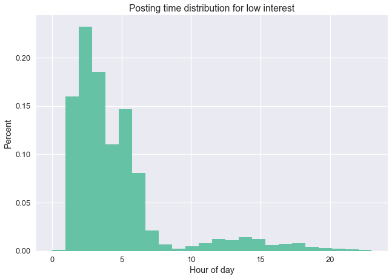

# Renthop dataset exploration

### Code setup and data loading


```python
import pandas as pd
import numpy as np
import matplotlib.pyplot as plt
import seaborn as sns
%matplotlib inline
path = '/Users/jason/svn/springboard/capstone/renthop'
# Orange color from colorbrewer2.org
highcolor="#fc8d62"
# Blue color from colorbrewer2.org
medcolor="#8da0cb"
# Green color from colorbrewer2.org
lowcolor="#66c2a5"
```


```python
#Load dataset
df = pd.read_json(path + '/train.json')

df.head()
```


<div>
<table border="1" class="dataframe">
  <thead>
    <tr style="text-align: right;">
      <th></th>
      <th>bathrooms</th>
      <th>bedrooms</th>
      <th>building_id</th>
      <th>created</th>
      <th>description</th>
      <th>display_address</th>
      <th>features</th>
      <th>interest_level</th>
      <th>latitude</th>
      <th>listing_id</th>
      <th>longitude</th>
      <th>manager_id</th>
      <th>photos</th>
      <th>price</th>
      <th>street_address</th>
    </tr>
  </thead>
  <tbody>
    <tr>
      <th>10</th>
      <td>1.5</td>
      <td>3</td>
      <td>53a5b119ba8f7b61d4e010512e0dfc85</td>
      <td>2016-06-24 07:54:24</td>
      <td>A Brand New 3 Bedroom 1.5 bath ApartmentEnjoy ...</td>
      <td>Metropolitan Avenue</td>
      <td>[]</td>
      <td>medium</td>
      <td>40.7145</td>
      <td>7211212</td>
      <td>-73.9425</td>
      <td>5ba989232d0489da1b5f2c45f6688adc</td>
      <td>[https://photos.renthop.com/2/7211212_1ed4542e...</td>
      <td>3000</td>
      <td>792 Metropolitan Avenue</td>
    </tr>
    <tr>
      <th>10000</th>
      <td>1.0</td>
      <td>2</td>
      <td>c5c8a357cba207596b04d1afd1e4f130</td>
      <td>2016-06-12 12:19:27</td>
      <td></td>
      <td>Columbus Avenue</td>
      <td>[Doorman, Elevator, Fitness Center, Cats Allow...</td>
      <td>low</td>
      <td>40.7947</td>
      <td>7150865</td>
      <td>-73.9667</td>
      <td>7533621a882f71e25173b27e3139d83d</td>
      <td>[https://photos.renthop.com/2/7150865_be3306c5...</td>
      <td>5465</td>
      <td>808 Columbus Avenue</td>
    </tr>
    <tr>
      <th>100004</th>
      <td>1.0</td>
      <td>1</td>
      <td>c3ba40552e2120b0acfc3cb5730bb2aa</td>
      <td>2016-04-17 03:26:41</td>
      <td>Top Top West Village location, beautiful Pre-w...</td>
      <td>W 13 Street</td>
      <td>[Laundry In Building, Dishwasher, Hardwood Flo...</td>
      <td>high</td>
      <td>40.7388</td>
      <td>6887163</td>
      <td>-74.0018</td>
      <td>d9039c43983f6e564b1482b273bd7b01</td>
      <td>[https://photos.renthop.com/2/6887163_de85c427...</td>
      <td>2850</td>
      <td>241 W 13 Street</td>
    </tr>
    <tr>
      <th>100007</th>
      <td>1.0</td>
      <td>1</td>
      <td>28d9ad350afeaab8027513a3e52ac8d5</td>
      <td>2016-04-18 02:22:02</td>
      <td>Building Amenities - Garage - Garden - fitness...</td>
      <td>East 49th Street</td>
      <td>[Hardwood Floors, No Fee]</td>
      <td>low</td>
      <td>40.7539</td>
      <td>6888711</td>
      <td>-73.9677</td>
      <td>1067e078446a7897d2da493d2f741316</td>
      <td>[https://photos.renthop.com/2/6888711_6e660cee...</td>
      <td>3275</td>
      <td>333 East 49th Street</td>
    </tr>
    <tr>
      <th>100013</th>
      <td>1.0</td>
      <td>4</td>
      <td>0</td>
      <td>2016-04-28 01:32:41</td>
      <td>Beautifully renovated 3 bedroom flex 4 bedroom...</td>
      <td>West 143rd Street</td>
      <td>[Pre-War]</td>
      <td>low</td>
      <td>40.8241</td>
      <td>6934781</td>
      <td>-73.9493</td>
      <td>98e13ad4b495b9613cef886d79a6291f</td>
      <td>[https://photos.renthop.com/2/6934781_1fa4b41a...</td>
      <td>3350</td>
      <td>500 West 143rd Street</td>
    </tr>
  </tbody>
</table>
</div>


## I. Does number of photos correlate with interest level
### a) Make number-of-photos feature


```python
# Make list of number of photos
n_photos = []
for elem in df.photos:
    n_photos.append(len(elem))
    
# Add number-of-photos as a new feature to the dataset
df["n_photos"] = n_photos

# Print descriptive statistics to sanity check n_photos variable
df.describe()
```


<div>
<table border="1" class="dataframe">
  <thead>
    <tr style="text-align: right;">
      <th></th>
      <th>bathrooms</th>
      <th>bedrooms</th>
      <th>latitude</th>
      <th>listing_id</th>
      <th>longitude</th>
      <th>price</th>
      <th>n_photos</th>
    </tr>
  </thead>
  <tbody>
    <tr>
      <th>count</th>
      <td>49352.00000</td>
      <td>49352.000000</td>
      <td>49352.000000</td>
      <td>4.935200e+04</td>
      <td>49352.000000</td>
      <td>4.935200e+04</td>
      <td>49352.000000</td>
    </tr>
    <tr>
      <th>mean</th>
      <td>1.21218</td>
      <td>1.541640</td>
      <td>40.741545</td>
      <td>7.024055e+06</td>
      <td>-73.955716</td>
      <td>3.830174e+03</td>
      <td>5.606946</td>
    </tr>
    <tr>
      <th>std</th>
      <td>0.50142</td>
      <td>1.115018</td>
      <td>0.638535</td>
      <td>1.262746e+05</td>
      <td>1.177912</td>
      <td>2.206687e+04</td>
      <td>3.632283</td>
    </tr>
    <tr>
      <th>min</th>
      <td>0.00000</td>
      <td>0.000000</td>
      <td>0.000000</td>
      <td>6.811957e+06</td>
      <td>-118.271000</td>
      <td>4.300000e+01</td>
      <td>0.000000</td>
    </tr>
    <tr>
      <th>25%</th>
      <td>1.00000</td>
      <td>1.000000</td>
      <td>40.728300</td>
      <td>6.915888e+06</td>
      <td>-73.991700</td>
      <td>2.500000e+03</td>
      <td>4.000000</td>
    </tr>
    <tr>
      <th>50%</th>
      <td>1.00000</td>
      <td>1.000000</td>
      <td>40.751800</td>
      <td>7.021070e+06</td>
      <td>-73.977900</td>
      <td>3.150000e+03</td>
      <td>5.000000</td>
    </tr>
    <tr>
      <th>75%</th>
      <td>1.00000</td>
      <td>2.000000</td>
      <td>40.774300</td>
      <td>7.128733e+06</td>
      <td>-73.954800</td>
      <td>4.100000e+03</td>
      <td>7.000000</td>
    </tr>
    <tr>
      <th>max</th>
      <td>10.00000</td>
      <td>8.000000</td>
      <td>44.883500</td>
      <td>7.753784e+06</td>
      <td>0.000000</td>
      <td>4.490000e+06</td>
      <td>68.000000</td>
    </tr>
  </tbody>
</table>
</div>


### b) Plot number-of-photos by interest level


```python
sns.stripplot(x="interest_level", y="n_photos", data=df, order=["low", "medium", "high"], jitter=True, alpha=0.2)
sns.violinplot(x="interest_level", y="n_photos", data=df, order=["low", "medium", "high"])
plt.show()
```


## II. Does length of description correlate with interest level?

### a) Create 'description length' feature


```python
# Compute length of each description
df_tmp = df[["description", "interest_level"]]
description_len = df_tmp.description.str.len()
```


```python
# Add description as new feature to dataframe
df["description_len"] = description_len
```

### b) Plot Description length vs Interest level


```python
#Make figure more readable
sns.set_context("talk")
plt.figure(figsize=(16, 12))
df_tmp = df[df.description_len < 100]
#Label and draw plot
sns.plt.title('Description length vs Interest level')
_ = sns.violinplot(x="interest_level", y="description_len", data=df_tmp, order=["low", "medium", "high"])
_ = sns.plt.ylabel('Description length (number of characters)')
```


## III. Does description length correlate with listing price?


```python
#Make figure more readable
sns.set_context("talk")
plt.figure(figsize=(10, 10))
#Remove outliers to get better view of heart of data
df_tmp = df[(df.interest_level == 'low') & (df.description_len < 1000) & (df.price < 1000000)] 
#Label and draw plot
sns.plt.title('Description length vs Price for Low Interest Listings')
_ = sns.plt.scatter(df_tmp.price, df_tmp.description_len, color=lowcolor)
_ = sns.plt.ylabel('Description length (number of characters)')
_ = sns.plt.xlabel('Price')
```


```python
#Make figure more readable
sns.set_context("talk")
plt.figure(figsize=(10, 10))
df_tmp = df[df.interest_level == 'medium'] 
#Label and draw plot
sns.plt.title('Description length vs Price for Medium Interest Listings')
_ = sns.plt.scatter(df_tmp.price, df_tmp.description_len, color=medcolor)
_ = sns.plt.ylabel('Description length (number of characters)')
_ = sns.plt.xlabel('Price')
```


```python
#Make figure more readable
sns.set_context("talk")
plt.figure(figsize=(10, 10))
df_tmp = df[(df.interest_level == 'high') & (df.price < 100000)] 
#Label and draw plot
sns.plt.title('Description length vs Price for High Interest Listings')
_ = sns.plt.scatter(df_tmp.price, df_tmp.description_len, color=highcolor)
_ = sns.plt.ylabel('Description length (number of characters)')
_ = sns.plt.xlabel('Price')
```


I thought that more expensive properties might have more features to describe in the advertisement. This does not seem to be the case. 

## IV. Does number of features in listing correspond with interest level?

### a) Add number of words in the 'features' section of each listing as a new dataset feature


```python
# Count number of words in features section of each listing
n_features_per_listing = []
for elem in df.features:
    n_features_per_listing.append(len(elem))
```


```python
# Add 'number of words in features section' as new dataset variable
df["n_features"] = n_features_per_listing
```


```python
# Take a quick look to make sure it seems correct
df.describe()
```


<div>
<table border="1" class="dataframe">
  <thead>
    <tr style="text-align: right;">
      <th></th>
      <th>bathrooms</th>
      <th>bedrooms</th>
      <th>latitude</th>
      <th>listing_id</th>
      <th>longitude</th>
      <th>price</th>
      <th>n_photos</th>
      <th>description_len</th>
      <th>n_features</th>
    </tr>
  </thead>
  <tbody>
    <tr>
      <th>count</th>
      <td>49352.00000</td>
      <td>49352.000000</td>
      <td>49352.000000</td>
      <td>4.935200e+04</td>
      <td>49352.000000</td>
      <td>4.935200e+04</td>
      <td>49352.000000</td>
      <td>49352.000000</td>
      <td>49352.000000</td>
    </tr>
    <tr>
      <th>mean</th>
      <td>1.21218</td>
      <td>1.541640</td>
      <td>40.741545</td>
      <td>7.024055e+06</td>
      <td>-73.955716</td>
      <td>3.830174e+03</td>
      <td>5.606946</td>
      <td>601.975624</td>
      <td>5.428473</td>
    </tr>
    <tr>
      <th>std</th>
      <td>0.50142</td>
      <td>1.115018</td>
      <td>0.638535</td>
      <td>1.262746e+05</td>
      <td>1.177912</td>
      <td>2.206687e+04</td>
      <td>3.632283</td>
      <td>393.592337</td>
      <td>3.923411</td>
    </tr>
    <tr>
      <th>min</th>
      <td>0.00000</td>
      <td>0.000000</td>
      <td>0.000000</td>
      <td>6.811957e+06</td>
      <td>-118.271000</td>
      <td>4.300000e+01</td>
      <td>0.000000</td>
      <td>0.000000</td>
      <td>0.000000</td>
    </tr>
    <tr>
      <th>25%</th>
      <td>1.00000</td>
      <td>1.000000</td>
      <td>40.728300</td>
      <td>6.915888e+06</td>
      <td>-73.991700</td>
      <td>2.500000e+03</td>
      <td>4.000000</td>
      <td>340.000000</td>
      <td>2.000000</td>
    </tr>
    <tr>
      <th>50%</th>
      <td>1.00000</td>
      <td>1.000000</td>
      <td>40.751800</td>
      <td>7.021070e+06</td>
      <td>-73.977900</td>
      <td>3.150000e+03</td>
      <td>5.000000</td>
      <td>564.000000</td>
      <td>5.000000</td>
    </tr>
    <tr>
      <th>75%</th>
      <td>1.00000</td>
      <td>2.000000</td>
      <td>40.774300</td>
      <td>7.128733e+06</td>
      <td>-73.954800</td>
      <td>4.100000e+03</td>
      <td>7.000000</td>
      <td>809.000000</td>
      <td>8.000000</td>
    </tr>
    <tr>
      <th>max</th>
      <td>10.00000</td>
      <td>8.000000</td>
      <td>44.883500</td>
      <td>7.753784e+06</td>
      <td>0.000000</td>
      <td>4.490000e+06</td>
      <td>68.000000</td>
      <td>4466.000000</td>
      <td>39.000000</td>
    </tr>
  </tbody>
</table>
</div>


### b) Plot relationship between number of words in 'features' description for each interest level


```python
def hist_per_interest_level(xvar,nbins=30):
    # Three subplots sharing both x/y axes
    plt.figure(figsize=(30,20))
    f, (ax1, ax2, ax3) = plt.subplots(3, sharex=True, sharey=True)
    # ax1.plot(x, y)
    ax1.hist(df[df.interest_level == "high"][xvar], bins=nbins, normed=True, color=highcolor)
    ax1.set_title('High interest')
    ax2.set_title('Medium interest')
    ax3.set_title('Low interest')
    ax2.hist(df[df.interest_level == "medium"][xvar], bins=nbins, normed=True, color=medcolor)
    ax3.hist(df[df.interest_level == "low"][xvar], bins=nbins, normed=True, color=lowcolor)
    ax3.set_xlabel(xvar)

_ = hist_per_interest_level("n_features")
_ = plt.show()

```


    <matplotlib.figure.Figure at 0x15f6d44d0>


## V. Does day of week posted correlate with interest level?

### a) Create 'day of week' feature


```python
# Create list with integer day of week
# 0, 1, 2,...6 = Monday, Tuesday, Wednesday,...Sunday
listing_day_of_week = []
for elem in df.created:
    listing_day_of_week.append(pd.Timestamp(elem).weekday())
```


```python
# Add 'day of week' feature to dataframe
df['day_of_week_listed'] = listing_day_of_week
```

### b) Draw histogram of day-of-week listed by interest level


```python
# Plot histogram for each interest level
hist_per_interest_level("day_of_week_listed",7)
plt.show()
```


    <matplotlib.figure.Figure at 0x1602b6b50>


### c) Draw scatter plot of day-of-week posted by interest level
The plot above indicates some differences between the groups, particularly on day 5. However, the vertical compression of the plots and the distance between them make it difficult to compare. So let's try a different graphical method to display this information.

#### i. Count number of listings posted each day of the week for each interest level


```python
list_day_count_high = df[['day_of_week_listed']][df.interest_level == "high"].groupby(df.day_of_week_listed).count()
list_day_count_low = df[['day_of_week_listed']][df.interest_level == "low"].groupby(df.day_of_week_listed).count()
list_day_count_med = df[['day_of_week_listed']][df.interest_level == "medium"].groupby(df.day_of_week_listed).count()
```

#### ii. Compute percentage of postings per day and create scatter plot


```python
a = sns.plt.scatter(range(7), list_day_count_high / np.sum(list_day_count_high), color=highcolor,marker="x",s=500)
b = sns.plt.scatter(range(7), list_day_count_low / np.sum(list_day_count_low),color=lowcolor, marker=7,s=500)
c = sns.plt.scatter(range(7), list_day_count_med / np.sum(list_day_count_med),color="#8da0cb",marker="o",s=500)

sns.plt.title('Posting day of week by interest level')
sns.plt.ylabel('Percent')
sns.plt.xlabel('Apartment listing day of week')
sns.plt.legend((a,b,c),('High Interest', 'Low Interest', 'Medium Interest'),markerscale=0.6,loc=8,frameon=True, fontsize="medium", facecolor="white")
plt.show()
```


## VI. Does posting time of day correlate with interest level?

### a) Create feature containing hour-of-day for each posting


```python
# Get hour-of-day posted as a list
listing_hour_of_day = []
for elem in df.created:
    listing_hour_of_day.append(pd.Timestamp(elem).hour)
```


```python
# Add list as new feature in the dataframe
df['listing_hour_of_day'] = listing_hour_of_day
```

### b) Draw separate histograms of hour-of-day posted for each interest level

Our earlier combined histogram was difficult to interpret. Since hour of day has more than three times as many data points as day-of-week, the scatter plot may feel cluttered, let's try separate histograms this time.

#### i) Histgram for hour-of-day posted for the high interest level


```python
def draw_hist_by_hour(interest_level, clr):
    sns.set_context("talk")
    _ = sns.plt.hist(df[df.interest_level == interest_level].listing_hour_of_day, bins=24, normed=True,color=clr)
    sns.plt.xlabel('Hour of day')
    sns.plt.ylabel('Percent')
    sns.plt.title('Posting time distribution for ' + interest_level + ' interest')

draw_hist_by_hour('high', highcolor)
```


#### i) Histgram for hour-of-day posted for the medium interest level


```python
draw_hist_by_hour('medium', medcolor)
```


#### i) Histgram for hour-of-day posted for the low interest level


```python
draw_hist_by_hour('low', lowcolor)
```


### c) Visualize postings by hour vs interest level as violin


```python
# Increase size for readability
sns.set_context("talk")
plt.figure(figsize=(16, 12))

# Draw violinplot
_ = sns.violinplot(x="interest_level", y="listing_hour_of_day", data=df, order=["low", "medium", "high"])
```





## VII. How does price correlate with interest level?


```python
# Remove large tail for low interest listings, so the
# majority of the data is easier to view
df_p = df[df.price < 10000]
_ = sns.violinplot(x="interest_level", y="price", data=df_p, order=["low", "medium", "high"])
```


```python

```


```python

```
