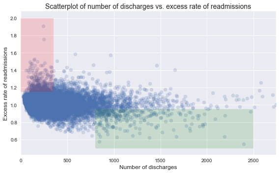

# Hospital Readmissions Data Analysis and Recommendations for Reduction

### Background
In October 2012, the US government's Center for Medicare and Medicaid Services (CMS) began reducing Medicare payments for Inpatient Prospective Payment System hospitals with excess readmissions. Excess readmissions are measured by a ratio, by dividing a hospital’s number of “predicted” 30-day readmissions for heart attack, heart failure, and pneumonia by the number that would be “expected,” based on an average hospital with similar patients. A ratio greater than 1 indicates excess readmissions.

### Exercise Directions

In this exercise, you will:
+ critique a preliminary analysis of readmissions data and recommendations (provided below) for reducing the readmissions rate
+ construct a statistically sound analysis and make recommendations of your own 

More instructions provided below. Include your work **in this notebook and submit to your Github account**. 

### Resources
+ Data source: https://data.medicare.gov/Hospital-Compare/Hospital-Readmission-Reduction/9n3s-kdb3
+ More information: http://www.cms.gov/Medicare/medicare-fee-for-service-payment/acuteinpatientPPS/readmissions-reduction-program.html
+ Markdown syntax: http://nestacms.com/docs/creating-content/markdown-cheat-sheet
****


```python
%matplotlib inline

import pandas as pd
import numpy as np
import matplotlib.pyplot as plt
import bokeh.plotting as bkp
from mpl_toolkits.axes_grid1 import make_axes_locatable
```


```python
# read in readmissions data provided
hospital_read_df = pd.read_csv('/Users/jason/svn/springboard/hospital_readmit/data/cms_hospital_readmissions.csv')
```

****
## Preliminary Analysis


```python
# deal with missing and inconvenient portions of data 
clean_hospital_read_df = hospital_read_df[hospital_read_df['Number of Discharges'] != 'Not Available']
clean_hospital_read_df.loc[:, 'Number of Discharges'] = clean_hospital_read_df['Number of Discharges'].astype(int)
clean_hospital_read_df = clean_hospital_read_df.sort_values('Number of Discharges')
```


```python
# generate a scatterplot for number of discharges vs. excess rate of readmissions
# lists work better with matplotlib scatterplot function
x = [a for a in clean_hospital_read_df['Number of Discharges'][81:-3]]
y = list(clean_hospital_read_df['Excess Readmission Ratio'][81:-3])

fig, ax = plt.subplots(figsize=(8,5))
ax.scatter(x, y,alpha=0.2)

ax.fill_between([0,350], 1.15, 2, facecolor='red', alpha = .15, interpolate=True)
ax.fill_between([800,2500], .5, .95, facecolor='green', alpha = .15, interpolate=True)

ax.set_xlim([0, max(x)])
ax.set_xlabel('Number of discharges', fontsize=12)
ax.set_ylabel('Excess rate of readmissions', fontsize=12)
ax.set_title('Scatterplot of number of discharges vs. excess rate of readmissions', fontsize=14)

ax.grid(True)
fig.tight_layout()
```





****

## Preliminary Report

Read the following results/report. While you are reading it, think about if the conclusions are correct, incorrect, misleading or unfounded. Think about what you would change or what additional analyses you would perform.

**A. Initial observations based on the plot above**
+ Overall, rate of readmissions is trending down with increasing number of discharges
+ With lower number of discharges, there is a greater incidence of excess rate of readmissions (area shaded red)
+ With higher number of discharges, there is a greater incidence of lower rates of readmissions (area shaded green) 

**B. Statistics**
+ In hospitals/facilities with number of discharges < 100, mean excess readmission rate is 1.023 and 63% have excess readmission rate greater than 1 
+ In hospitals/facilities with number of discharges > 1000, mean excess readmission rate is 0.978 and 44% have excess readmission rate greater than 1 

**C. Conclusions**
+ There is a significant correlation between hospital capacity (number of discharges) and readmission rates. 
+ Smaller hospitals/facilities may be lacking necessary resources to ensure quality care and prevent complications that lead to readmissions.

**D. Regulatory policy recommendations**
+ Hospitals/facilties with small capacity (< 300) should be required to demonstrate upgraded resource allocation for quality care to continue operation.
+ Directives and incentives should be provided for consolidation of hospitals and facilities to have a smaller number of them with higher capacity and number of discharges.

****
<div class="span5 alert alert-info">
### Exercise

Include your work on the following **in this notebook and submit to your Github account**. 

A. Do you agree with the above analysis and recommendations? Why or why not?
   
B. Provide support for your arguments and your own recommendations with a statistically sound analysis:

   1. Setup an appropriate hypothesis test.
   2. Compute and report the observed significance value (or p-value).
   3. Report statistical significance for $\alpha$ = .01. 
   4. Discuss statistical significance and practical significance. Do they differ here? How does this change your recommendation to the client?
   5. Look at the scatterplot above. 
      - What are the advantages and disadvantages of using this plot to convey information?
      - Construct another plot that conveys the same information in a more direct manner.


You can compose in notebook cells using Markdown: 
+ In the control panel at the top, choose Cell > Cell Type > Markdown
+ Markdown syntax: http://nestacms.com/docs/creating-content/markdown-cheat-sheet
</div>
****

## B. Do smaller hospitals have more readmissions per discharge?

Is there a statistical difference between the number of readmissions from hospitals with fewer than 300 discharges when compared to hospitals with more discharges in our sample.

### i. Create dataframes with relevant variables


```python
foo = clean_hospital_read_df[clean_hospital_read_df["Number of Discharges"] == 781]
foo.head(100)
```


<div>
<table border="1" class="dataframe">
  <thead>
    <tr style="text-align: right;">
      <th></th>
      <th>Hospital Name</th>
      <th>Provider Number</th>
      <th>State</th>
      <th>Measure Name</th>
      <th>Number of Discharges</th>
      <th>Footnote</th>
      <th>Excess Readmission Ratio</th>
      <th>Predicted Readmission Rate</th>
      <th>Expected Readmission Rate</th>
      <th>Number of Readmissions</th>
      <th>Start Date</th>
      <th>End Date</th>
    </tr>
  </thead>
  <tbody>
    <tr>
      <th>5825</th>
      <td>STORMONT-VAIL HEALTHCARE</td>
      <td>170086</td>
      <td>KS</td>
      <td>READM-30-COPD-HRRP</td>
      <td>781</td>
      <td>NaN</td>
      <td>1.0124</td>
      <td>20.1</td>
      <td>19.9</td>
      <td>158.0</td>
      <td>07/01/2010</td>
      <td>06/30/2013</td>
    </tr>
    <tr>
      <th>915</th>
      <td>TRINITY BETTENDORF</td>
      <td>160104</td>
      <td>IA</td>
      <td>READM-30-HIP-KNEE-HRRP</td>
      <td>781</td>
      <td>NaN</td>
      <td>1.1351</td>
      <td>5.3</td>
      <td>4.7</td>
      <td>44.0</td>
      <td>07/01/2010</td>
      <td>06/30/2013</td>
    </tr>
    <tr>
      <th>13591</th>
      <td>MERITUS MEDICAL CENTER</td>
      <td>210001</td>
      <td>MD</td>
      <td>READM-30-HIP-KNEE-HRRP</td>
      <td>781</td>
      <td>NaN</td>
      <td>0.7764</td>
      <td>3.9</td>
      <td>5.0</td>
      <td>26.0</td>
      <td>07/01/2010</td>
      <td>06/30/2013</td>
    </tr>
    <tr>
      <th>13590</th>
      <td>MERCY MEDICAL CENTER - CEDAR RAPIDS</td>
      <td>160079</td>
      <td>IA</td>
      <td>READM-30-HIP-KNEE-HRRP</td>
      <td>781</td>
      <td>NaN</td>
      <td>0.7764</td>
      <td>3.8</td>
      <td>4.9</td>
      <td>25.0</td>
      <td>07/01/2010</td>
      <td>06/30/2013</td>
    </tr>
  </tbody>
</table>
</div>


```python
#Extract relevant variables and remove hospitals with 0 discharges
df = clean_hospital_read_df[["Number of Discharges", "Excess Readmission Ratio"]]
df = df[clean_hospital_read_df['Number of Discharges'] > 0]

def hospital_report(df, name):
    print(name + ' hospitals:')
    print('-------------------------------')
    print(df.describe())
    print('\n')

df_small = df[df['Number of Discharges'] < 300]
df_large = df[df['Number of Discharges'] >= 300]

hospital_report(df_small, 'Small')
hospital_report(df_large, 'Large')
hospital_report(df, 'All')
```

    Small hospitals:
    -------------------------------
           Number of Discharges  Excess Readmission Ratio
    count           6108.000000               6108.000000
    mean             169.507695                  1.014238
    std               69.856447                  0.082478
    min               25.000000                  0.760200
    25%              111.000000                  0.961100
    50%              166.000000                  1.006850
    75%              227.250000                  1.056525
    max              299.000000                  1.909500
    
    
    Large hospitals:
    -------------------------------
           Number of Discharges  Excess Readmission Ratio
    count           5389.000000               5389.000000
    mean             587.569493                  0.999871
    std              324.031532                  0.101118
    min              300.000000                  0.549500
    25%              379.000000                  0.938500
    50%              491.000000                  0.998600
    75%              679.000000                  1.060800
    max             6793.000000                  1.583600
    
    
    All hospitals:
    -------------------------------
           Number of Discharges  Excess Readmission Ratio
    count          11497.000000              11497.000000
    mean             365.466209                  1.007504
    std              308.754590                  0.091964
    min               25.000000                  0.549500
    25%              160.000000                  0.952600
    50%              282.000000                  1.003500
    75%              474.000000                  1.058100
    max             6793.000000                  1.909500
    
    


### ii. What is the mean and confidence interval of each group?


```python
from scipy import stats
class sample(object):
    
    def __init__(self, feature, alpha=0.01):
        self.feature = np.array(feature)
        self.mu_hat = -1
        self.variance = -1
        self.standard_deviation = -1
        self.nobs = len(feature)
        self.alpha = alpha
        
    def mean(self):
        self.mu_hat = np.mean(self.feature)
        
    def var(self):
        if self.mu_hat < 0:
            self.mean()
        
        residuals = self.mu_hat - self.feature
        self.variance = np.dot(residuals, residuals) / self.nobs
        
    def sd(self):
        if self.variance < 0:
            self.var()
            
        self.standard_deviation = np.sqrt(self.variance)
        
    def ci(self):
        # divided by 2 so we center our interval
        n_sds = stats.norm.ppf(self.alpha / 2)
        tmp = self.standard_deviation / np.sqrt(self.nobs)
        return [self.mu_hat + n_sds * tmp, self.mu_hat - n_sds * tmp]
        
    def z_score_mean(self,other_mean):
        other_mean = np.array(other_mean)
        if self.mu_hat < 0:
            self.mean()
            
        return (other_mean - self.mu_hat) / (self.standard_deviation / np.sqrt(self.nobs))
        
    def __str__(self):
        if self.standard_deviation < 0:
            self.sd()
            
        return "Number of observations: " + str(self.nobs)\
               + "\n" + "Mean = " + str(np.round(self.mu_hat,3))\
               + "\n" + str(1 - self.alpha) + "% Confidence Interval:"\
               + "\n" + str(self.ci()) \
               + "\n" + "Variance = " + str(np.round(self.variance, 4))\
               + "\n" + "Standard deviation = " + str(np.round(self.standard_deviation, 4))
            

class hospitals(sample):
    def __init__(self, feature, sample_name, alpha=0.01):
        self.feature = feature
        self.mu_hat = -1
        self.variance = -1
        self.standard_deviation = -1
        self.nobs = len(feature)
        self.sample_name = sample_name
        self.alpha = alpha
       
    def __str__(self):
        if self.standard_deviation < 0:
            self.sd()
            
        return self.sample_name + " hospitals\n-------------------------\n" + "Number of observations: " + str(self.nobs)\
               + "\n" + "Mean = " + str(np.round(self.mu_hat,3))\
               + "\n" + "Confidence interval (alpha = " + str(self.alpha) + "): "\
               + str(self.ci())\
               + "\n" + "Variance = " + str(np.round(self.variance, 4))\
               + "\n" + "Standard deviation = " + str(np.round(self.standard_deviation, 4)) + "\n"
    
```


```python
feature = 'Excess Readmission Ratio'
small = hospitals(df_small[feature], 'Small')
print(small)

large = hospitals(df_large[feature], 'Large')
print(large)

All = hospitals((df[feature]), 'All')
print(All)
```

    Small hospitals
    -------------------------
    Number of observations: 6108
    Mean = 1.014
    Confidence interval (alpha = 0.01): [1.011520075883662, 1.016956348477827]
    Variance = 0.0068
    Standard deviation = 0.0825
    
    Large hospitals
    -------------------------
    Number of observations: 5389
    Mean = 1.0
    Confidence interval (alpha = 0.01): [0.99632310405136881, 1.0034185919961338]
    Variance = 0.0102
    Standard deviation = 0.1011
    
    All hospitals
    -------------------------
    Number of observations: 11497
    Mean = 1.008
    Confidence interval (alpha = 0.01): [1.0052946344622034, 1.0097129327292258]
    Variance = 0.0085
    Standard deviation = 0.092
    


### iii. Is the small hospital group different from the entire hospital group?


```python
print('z_score = ' + str(All.z_score_mean(small.mu_hat)))
print('Critical z score = ' + str(stats.norm.ppf(0.99)))
print('p-val = ' + str(1 - stats.norm.cdf(All.z_score_mean(small.mu_hat))))
```

    z_score = 7.85222610318
    Critical z score = 2.32634787404
    p-val = 1.99840144433e-15


Since the z score greater than our threshold z-score, we do find support for the hypothesis that hospitals with fewer than 300 discharges do have higher 'excess admission rate'.

### iv. Practical significance

Now that we have determined that it is likely that smaller hospitals do have a higher rate of readmission than the CMS model predicts. We do not have enough information to quantify the practical effects of this difference. To quantify this relationship, we might want to know: that actual number of excess readmissions per hosptial (the data surprisingly does not allow us to calculate this), the cost of these readmissions (especially compared to other hospitals with fewer readmissions) and the long term outcomes of these patients.

If we assume that after the above recommended investigation, we conclude that these excess readmissions are practically significant, we may want to look for causes other than technology. As one example, could smaller hospitals have higher readmission rates, because they serve patients from more sparsely populated areas who are less likely to follow-up with their doctor, because of travel required in more remote areas? Finally if technology or expertise of large hospitals is found to be a key element, could we find patients at admission (or some first stable state) that would benefit from a transfer to a larger hospital? These questions may lead us to options that are more effective and affordable.


```python

```
